## 空间文档解析处理 <!-- {docsify-ignore-all} -->

   

### 处理过程

```plantuml
@startuml
hide empty description
<style>
root {
  HyperlinkColor #42b983
}
</style>

hide empty description
state "开始" as Begin <<start>> [[$./space_parse#begin {"开始"}]]
state "准备文档参数" as PREPAREPARAM_02  [[$./space_parse#prepareparam_02 {"准备文档参数"}]]
state "获取文档同步数据" as DEACTION_01  [[$./space_parse#deaction_01 {"获取文档同步数据"}]]
state "准备空间参数" as PREPAREPARAM_01  [[$./space_parse#prepareparam_01 {"准备空间参数"}]]
state "查询空间启用的页面" as DEDATASET_01  [[$./space_parse#dedataset_01 {"查询空间启用的页面"}]]
state "查询已同步页面" as DEDATASET_02  [[$./space_parse#dedataset_02 {"查询已同步页面"}]]
state "查询最新空间文档" as DEDATASET_03  [[$./space_parse#dedataset_03 {"查询最新空间文档"}]]
state "处理未同步页面" as RAWSFCODE_01  [[$./space_parse#rawsfcode_01 {"处理未同步页面"}]]
state "清理冗余的doc" as RAWSFCODE_02  [[$./space_parse#rawsfcode_02 {"清理冗余的doc"}]]
state "结束" as END_01 <<end>> [[$./space_parse#end_01 {"结束"}]]
state "解析空间下文档" as LOOPSUBCALL_02  [[$./space_parse#loopsubcall_02 {"解析空间下文档"}]] #green {
state "解析文档" as DEACTION_03  [[$./space_parse#deaction_03 {"解析文档"}]]
}


Begin --> DEACTION_01
DEACTION_01 --> PREPAREPARAM_01 : [[$./space_parse#deaction_01-prepareparam_01{连接名称} 连接名称]]
PREPAREPARAM_01 --> DEDATASET_01
DEDATASET_01 --> PREPAREPARAM_02
PREPAREPARAM_02 --> DEDATASET_02
DEDATASET_02 --> RAWSFCODE_02
RAWSFCODE_02 --> RAWSFCODE_01 : [[$./space_parse#rawsfcode_02-rawsfcode_01{连接名称} 连接名称]]
RAWSFCODE_01 --> DEDATASET_03
DEDATASET_03 --> LOOPSUBCALL_02 : [[$./space_parse#dedataset_03-loopsubcall_02{连接名称} 连接名称]]
LOOPSUBCALL_02 --> DEACTION_03
LOOPSUBCALL_02 --> END_01


@enduml
```




### 处理步骤说明

#### 开始 :id=Begin<sup class="footnote-symbol"> <font color=gray size=1>[开始]</font></sup>


*- N/A*
#### 准备文档参数 :id=PREPAREPARAM_02<sup class="footnote-symbol"> <font color=gray size=1>[准备参数]</font></sup>


1. 将`doc_sync.ID(标识)` 设置给  `doc_filter.N_SYNC_ID_EQ`
2. 将`2000` 设置给  `doc_filter.size(内容大小)`

#### 获取文档同步数据 :id=DEACTION_01<sup class="footnote-symbol"> <font color=gray size=1>[实体行为]</font></sup>

根据extend_schedule_task的payload获取文档同步数据

调用实体 [知识库文档同步(AI_KB_DOCUMENT_SYNC)](module/ai/ai_kb_document_sync.md) 行为 [Get](module/ai/ai_kb_document_sync#行为) ，行为参数为`Default(传入变量)`

将执行结果返回给参数`doc_sync`

#### 准备空间参数 :id=PREPAREPARAM_01<sup class="footnote-symbol"> <font color=gray size=1>[准备参数]</font></sup>


1. 将`doc_sync.SOURCE_ID(源标识)` 设置给  `page_filter.n_space_id_eq`
2. 将`1500` 设置给  `page_filter.size`

#### 查询空间启用的页面 :id=DEDATASET_01<sup class="footnote-symbol"> <font color=gray size=1>[实体数据集]</font></sup>


调用实体 [页面(PAGE)](module/Wiki/article_page.md) 数据集合 [仅页面(only_page)](module/Wiki/article_page#数据集合) ，查询参数为`page_filter`

将执行结果返回给参数`all_pages`

#### 查询已同步页面 :id=DEDATASET_02<sup class="footnote-symbol"> <font color=gray size=1>[实体数据集]</font></sup>


调用实体 [知识库文档(AI_KB_DOCUMENT)](module/ai/ai_kb_document.md) 数据集合 [DEFAULT](module/ai/ai_kb_document#数据集合) ，查询参数为`doc_filter`

将执行结果返回给参数`docs`

#### 查询最新空间文档 :id=DEDATASET_03<sup class="footnote-symbol"> <font color=gray size=1>[实体数据集]</font></sup>


调用实体 [知识库文档(AI_KB_DOCUMENT)](module/ai/ai_kb_document.md) 数据集合 [DEFAULT](module/ai/ai_kb_document#数据集合) ，查询参数为`doc_filter`

将执行结果返回给参数`docs`

#### 处理未同步页面 :id=RAWSFCODE_01<sup class="footnote-symbol"> <font color=gray size=1>[直接后台代码]</font></sup>


<p class="panel-title"><b>执行代码[Groovy]</b></p>

```groovy
def _all_pages = logic.param('all_pages')?.getReal() ?: []
def _docs = logic.param('docs')?.getReal() ?: []
def _doc_sync = logic.param('doc_sync')?.getReal() ?: []
def doc_pageids_in_space = (_docs?.collect { it?.source_id }?.findAll { it != null } ?: []) as Set
def doc_runtime = sys.dataentity('ai_kb_document')

println "已有pageId: $doc_pageids_in_space"  

def pages_without_doc = _all_pages.findAll { !doc_pageids_in_space.contains(it.id)}

println "未存在pageId: ${pages_without_doc*.id}"  

pages_without_doc.each { page ->
    println "页面ID: ${page.id}, 页面: ${page.name}"
    def new_doc = doc_runtime.entity()
    new_doc.set('custom_chunk',0)
    new_doc.set('source_id',page.id)
    new_doc.set('name',page.name)
    new_doc.set('sync_frequency',_doc_sync.sync_frequency)
    new_doc.set('status',0)
    new_doc.set('sync_id',_doc_sync.id)
    new_doc.set('type','space')
    new_doc.set('source_type','page')
    new_doc.set('kb_id',_doc_sync.ai_knowledge_base_id)
    doc_runtime.create(new_doc)
}


```

#### 清理冗余的doc :id=RAWSFCODE_02<sup class="footnote-symbol"> <font color=gray size=1>[直接后台代码]</font></sup>

清除page被删除对应的doc

<p class="panel-title"><b>执行代码[Groovy]</b></p>

```groovy
def _all_pages = logic.param('all_pages')?.getReal() ?: []
def _docs = logic.param('docs')?.getReal() ?: []
def all_pages_in_space = _all_pages*.id.toSet()
def no_exist_pages_doc = _docs.findAll { !all_pages_in_space.contains(it.source_id) }
println "已删除page的doc: ${no_exist_pages_doc*.source_id}"  

if(no_exist_pages_doc){
    def doc_runtime = sys.dataentity('ai_kb_document')
    no_exist_pages_doc.each { doc ->
        doc_runtime.remove(doc)
    }
}


```

#### 解析空间下文档 :id=LOOPSUBCALL_02<sup class="footnote-symbol"> <font color=gray size=1>[循环子调用]</font></sup>


循环参数`docs`，子循环参数使用`doc`
#### 结束 :id=END_01<sup class="footnote-symbol"> <font color=gray size=1>[结束]</font></sup>


返回 `Default(传入变量)`

#### 解析文档 :id=DEACTION_03<sup class="footnote-symbol"> <font color=gray size=1>[实体行为]</font></sup>


调用实体 [知识库文档(AI_KB_DOCUMENT)](module/ai/ai_kb_document.md) 行为 [文档解析处理(parse)](module/ai/ai_kb_document#行为) ，行为参数为`doc`


### 连接条件说明
#### 连接名称 :id=DEACTION_01-PREPAREPARAM_01

`doc_sync(doc_sync).SOURCE_ID(源标识)` ISNOTNULL
#### 连接名称 :id=RAWSFCODE_02-RAWSFCODE_01

`all_pages(all_pages).size` GT `0`
#### 连接名称 :id=DEDATASET_03-LOOPSUBCALL_02

`docs(docs).size(内容大小)` GT `0`


### 实体逻辑参数

|    中文名   |    代码名    |  数据类型    |  实体   |备注 |
| --------| --------| -------- | -------- | --------   |
|传入变量(<i class="fa fa-check"/></i>)|Default|数据对象|[知识库文档同步(AI_KB_DOCUMENT_SYNC)](module/ai/ai_kb_document_sync.md)||
|all_pages|all_pages|分页查询|||
|doc|doc|数据对象|[知识库文档(AI_KB_DOCUMENT)](module/ai/ai_kb_document.md)||
|doc_filter|doc_filter|过滤器|||
|doc_sync|doc_sync|数据对象|[知识库文档同步(AI_KB_DOCUMENT_SYNC)](module/ai/ai_kb_document_sync.md)||
|docs|docs|分页查询|||
|page|page|数据对象|[页面(PAGE)](module/Wiki/article_page.md)||
|page_filter|page_filter|过滤器|||
|pages_notin_docs|pages_notin_docs|分页查询|||
|temp_docs|temp_docs|数据对象|||
