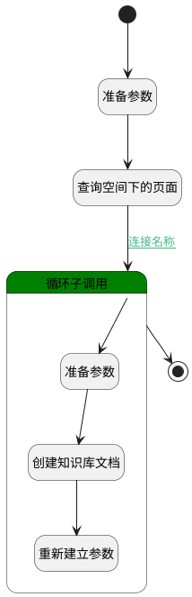

## 同步创建知识库文档 <!-- {docsify-ignore-all} -->

   

### 处理过程




### 处理步骤说明

#### 准备参数 :id=PREPAREPARAM_01<sup class="footnote-symbol"> <font color=gray size=1>[准备参数]</font></sup>


1. 将`Default(传入变量).SOURCE_ID(源标识)` 设置给  `page_filter.n_space_id_eq`
2. 将`1000` 设置给  `page_filter.size`

#### 查询空间下的页面 :id=DEDATASET_01<sup class="footnote-symbol"> <font color=gray size=1>[实体数据集]</font></sup>


调用实体 [页面(PAGE)](module/Wiki/article_page.md) 数据集合 [正常(normal)](module/Wiki/article_page#数据集合) ，查询参数为`page_filter`

将执行结果返回给参数`pages`

#### 开始 :id=Begin<sup class="footnote-symbol"> <font color=gray size=1>[开始]</font></sup>


*- N/A*
#### 循环子调用 :id=LOOPSUBCALL_01<sup class="footnote-symbol"> <font color=gray size=1>[循环子调用]</font></sup>


循环参数`pages`，子循环参数使用`page`
#### 准备参数 :id=PREPAREPARAM_02<sup class="footnote-symbol"> <font color=gray size=1>[准备参数]</font></sup>


1. 将`ai_kb_doc_wizard.PARSER_CONFIG(解析配置)` 设置给  `kb_doc.PARSER_CONFIG(解析配置)`
2. 将`ai_kb_doc_wizard.CUSTOM_CHUNK(自定义切片)` 设置给  `kb_doc.CUSTOM_CHUNK(自定义切片)`
3. 将`ai_kb_doc_wizard.CHUNK_METHOD(切片方法)` 设置给  `kb_doc.CHUNK_METHOD(切片方法)`
4. 将`Default(传入变量).AI_KNOWLEDGE_BASE_ID(知识库标识)` 设置给  `kb_doc.KB_ID(知识库标识)`
5. 将`page.ID(标识)` 设置给  `kb_doc.SOURCE_ID(源标识)`
6. 将`page` 设置给  `kb_doc.SOURCE_TYPE(源类型)`
7. 将`space` 设置给  `kb_doc.TYPE(文档类型)`
8. 将`page.NAME(主题)` 设置给  `kb_doc.NAME(知识库文档名称)`
9. 将`1` 设置给  `kb_doc.ACTIVE(是否启用)`
10. 将`0` 设置给  `kb_doc.STATUS(状态)`
11. 将`Default(传入变量).ID(标识)` 设置给  `kb_doc.SYNC_ID(文档同步标识)`
12. 将`Default(传入变量).SYNC_FREQUENCY(同步频率)` 设置给  `kb_doc.SYNC_FREQUENCY(同步频率)`

#### 结束 :id=END_01<sup class="footnote-symbol"> <font color=gray size=1>[结束]</font></sup>


*- N/A*

#### 创建知识库文档 :id=DEACTION_01<sup class="footnote-symbol"> <font color=gray size=1>[实体行为]</font></sup>


调用实体 [知识库文档(AI_KB_DOCUMENT)](module/ai/ai_kb_document.md) 行为 [Create](module/ai/ai_kb_document#行为) ，行为参数为`kb_doc`

#### 重新建立参数 :id=RENEWPARAM_01<sup class="footnote-symbol"> <font color=gray size=1>[重新建立参数]</font></sup>


重建参数```kb_doc(kb_doc)```

### 连接条件说明
#### 连接名称 :id=DEDATASET_01-LOOPSUBCALL_01

`pages(pages).size` GT `0`


### 实体逻辑参数

|    中文名   |    代码名    |  数据类型    |  实体   |备注 |
| --------| --------| -------- | -------- | --------   |
|传入变量(<i class="fa fa-check"/></i>)|Default|数据对象|[知识库文档同步(AI_KB_DOCUMENT_SYNC)](module/ai/ai_kb_document_sync.md)||
|ai_kb_doc_wizard|ai_kb_doc_wizard|会话变量|||
|kb_doc|kb_doc|数据对象|[知识库文档(AI_KB_DOCUMENT)](module/ai/ai_kb_document.md)||
|page|page|数据对象|[页面(PAGE)](module/Wiki/article_page.md)||
|page_filter|page_filter|过滤器|||
|pages|pages|分页查询|||
