## 同步删除文档和分块 <!-- {docsify-ignore-all} -->

   

### 处理过程

```plantuml
@startuml
hide empty description
<style>
root {
  HyperlinkColor #42b983
}
</style>

hide empty description
state "开始" as Begin <<start>> [[$./sync_remove_doc_chunk#begin {"开始"}]]
state "删除文档分块" as RAWSQLCALL_02  [[$./sync_remove_doc_chunk#rawsqlcall_02 {"删除文档分块"}]]
state "删除文档" as RAWSQLCALL_01  [[$./sync_remove_doc_chunk#rawsqlcall_01 {"删除文档"}]]
state "结束" as END_01 <<end>> [[$./sync_remove_doc_chunk#end_01 {"结束"}]]


Begin --> RAWSQLCALL_02
RAWSQLCALL_02 --> RAWSQLCALL_01
RAWSQLCALL_01 --> END_01


@enduml
```




### 处理步骤说明

#### 开始 :id=Begin<sup class="footnote-symbol"> <font color=gray size=1>[开始]</font></sup>


*- N/A*
#### 删除文档分块 :id=RAWSQLCALL_02<sup class="footnote-symbol"> <font color=gray size=1>[直接SQL调用]</font></sup>


<p class="panel-title"><b>执行sql语句</b></p>

```sql
DELETE c FROM ai_kb_chunk  c WHERE  exists (select 1 from ai_kb_document doc where doc.id=c.document_id and doc.SYNC_ID= ? )
```

<p class="panel-title"><b>执行sql参数</b></p>

1. `Default(传入变量).ID(标识)`


#### 删除文档 :id=RAWSQLCALL_01<sup class="footnote-symbol"> <font color=gray size=1>[直接SQL调用]</font></sup>


<p class="panel-title"><b>执行sql语句</b></p>

```sql
DELETE doc FROM ai_kb_document doc WHERE doc.sync_id = ?
```

<p class="panel-title"><b>执行sql参数</b></p>

1. `Default(传入变量).ID(标识)`


#### 结束 :id=END_01<sup class="footnote-symbol"> <font color=gray size=1>[结束]</font></sup>


*- N/A*


### 实体逻辑参数

|    中文名   |    代码名    |  数据类型    |  实体   |备注 |
| --------| --------| -------- | -------- | --------   |
|传入变量(<i class="fa fa-check"/></i>)|Default|数据对象|[知识库文档同步(AI_KB_DOCUMENT_SYNC)](module/ai/ai_kb_document_sync.md)||
