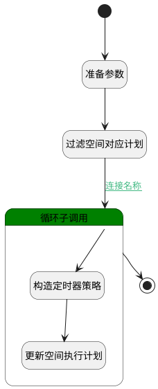

## 更新空间执行计划 <!-- {docsify-ignore-all} -->

   

### 处理过程




### 处理步骤说明

#### 准备参数 :id=PREPAREPARAM_01<sup class="footnote-symbol"> <font color=gray size=1>[准备参数]</font></sup>


1. 将`1000` 设置给  `extend_schedule_filter.size`
2. 将`Default(传入变量).ID(标识)` 设置给  `extend_schedule_filter.n_principal_id_eq`

#### 过滤空间对应计划 :id=DEDATASET_01<sup class="footnote-symbol"> <font color=gray size=1>[实体数据集]</font></sup>


调用实体 [扩展执行计划(EXTEND_SCHEDULE)](module/Base/extend_schedule.md) 数据集合 [DEFAULT](module/Base/extend_schedule#数据集合) ，查询参数为`extend_schedule_filter`

将执行结果返回给参数`extend_schedule_pages`

#### 开始 :id=Begin<sup class="footnote-symbol"> <font color=gray size=1>[开始]</font></sup>


*- N/A*
#### 循环子调用 :id=LOOPSUBCALL_01<sup class="footnote-symbol"> <font color=gray size=1>[循环子调用]</font></sup>


循环参数`extend_schedule_pages`，子循环参数使用`extend_schedule(task)`
#### 结束 :id=END_01<sup class="footnote-symbol"> <font color=gray size=1>[结束]</font></sup>


*- N/A*

#### 构造定时器策略 :id=RAWSFCODE_01<sup class="footnote-symbol"> <font color=gray size=1>[直接后台代码]</font></sup>


<p class="panel-title"><b>执行代码[Groovy]</b></p>

```groovy
def _default = logic.param('default').getReal()
def _extend_schedule = logic.param('extend_schedule').getReal()
def sync_frequency = _default.sync_frequency
def frequencyMap = [
    'daily': '0 0 * * *',
    'weekly': '0 0 * * 1', 
    'monthly': '0 0 1 * *'
]
_extend_schedule.timer_policy = frequencyMap[sync_frequency]
```

#### 更新空间执行计划 :id=DEACTION_01<sup class="footnote-symbol"> <font color=gray size=1>[实体行为]</font></sup>


调用实体 [扩展执行计划(EXTEND_SCHEDULE)](module/Base/extend_schedule.md) 行为 [Update](module/Base/extend_schedule#行为) ，行为参数为`extend_schedule(task)`


### 连接条件说明
#### 连接名称 :id=DEDATASET_01-LOOPSUBCALL_01

`extend_schedule_pages(extend_schedule_pages).size` GT `0`


### 实体逻辑参数

|    中文名   |    代码名    |  数据类型    |  实体   |备注 |
| --------| --------| -------- | -------- | --------   |
|传入变量(<i class="fa fa-check"/></i>)|Default|数据对象|[知识库文档同步(AI_KB_DOCUMENT_SYNC)](module/ai/ai_kb_document_sync.md)||
|task|extend_schedule|数据对象|[扩展执行计划(EXTEND_SCHEDULE)](module/Base/extend_schedule.md)||
|extend_schedule_filter|extend_schedule_filter|过滤器|||
|extend_schedule_pages|extend_schedule_pages|分页查询|||
