## 刷新文档同步表格 <!-- {docsify-ignore-all} -->

   

### 处理过程

```plantuml
@startuml
hide footbox
<style>
root {
  HyperlinkColor #42b983
}
</style>

hide empty description
state "开始" as Begin <<start>> [[$./refresh_doc_sync_grid#begin {开始}]]
state "刷新表格" as RAWJSCODE_01  [[$./refresh_doc_sync_grid#rawjscode_01 {刷新表格}]]


Begin --> RAWJSCODE_01


@enduml
```




### 处理步骤说明

#### 开始 :id=Begin<sup class="footnote-symbol"> <font color=gray size=1>[开始]</font></sup>


#### 刷新表格 :id=RAWJSCODE_01<sup class="footnote-symbol"> <font color=gray size=1>[直接前台代码]</font></sup>


<p class="panel-title"><b>执行代码</b></p>

```javascript
if (uiLogic.grid) {
    uiLogic.grid.refresh();
}
```


### 实体逻辑参数

|    中文名   |    代码名    |  数据类型      |备注 |
| --------| --------| --------  | --------   |
|grid|grid|当前部件对象||
|传入变量(<i class="fa fa-check"/></i>)|Default|数据对象||
