## 创建知识库文档 <!-- {docsify-ignore-all} -->

   

### 处理过程

```plantuml
@startuml
hide empty description
<style>
root {
  HyperlinkColor #42b983
}
</style>

hide empty description
state "开始" as Begin <<start>> [[$./create_ai_kb_doc#begin {"开始"}]]
state "创建知识库文档" as RAWSFCODE_01  [[$./create_ai_kb_doc#rawsfcode_01 {"创建知识库文档"}]]
state "结束" as END_01 <<end>> [[$./create_ai_kb_doc#end_01 {"结束"}]]


Begin --> RAWSFCODE_01
RAWSFCODE_01 --> END_01


@enduml
```




### 处理步骤说明

#### 开始 :id=Begin<sup class="footnote-symbol"> <font color=gray size=1>[开始]</font></sup>


*- N/A*
#### 创建知识库文档 :id=RAWSFCODE_01<sup class="footnote-symbol"> <font color=gray size=1>[直接后台代码]</font></sup>


<p class="panel-title"><b>执行代码[Groovy]</b></p>

```groovy
def _default = logic.param('default').getReal(); 
def doc_runtime = sys.dataentity('ai_kb_document')
def doc_sync_runtime = sys.dataentity('ai_kb_document_sync')
def page_list = sys.codelist('Wiki__page_list')
def space_list = sys.codelist('Wiki__space_list')

def import_method=_default["import_method"];
def kb_id=_default["kb_id"]
def space_selection=_default["space_selection"]
def sync_frequency=_default["sync_frequency"]
def parser_config=_default["parser_config"]
def custom_chunk=_default["custom_chunk"]
def chunk_method=_default["chunk_method"]

//手动从空间导入
if(import_method == "space_manual"){
    def selection_page_ids=_default["selection_page_ids"]
    if(selection_page_ids){
        //创建文档
        selection_page_ids.split(',').each { String page_id ->
            def new_doc=doc_runtime.entity()
            def  page_name=page_list.getText(page_id)  
            new_doc.set("name",page_name)
            new_doc.set("source_id",page_id)
            new_doc.set("source_type","page")
            new_doc.set("sync_frequency",sync_frequency)
            new_doc.set("parser_config",parser_config)
            new_doc.set("type","space")
            new_doc.set("custom_chunk",custom_chunk)
            new_doc.set("chunk_method",chunk_method)
            new_doc.set("active",1)
            new_doc.set("kb_id",kb_id)
            new_doc.set("status",0)
            doc_runtime.create(new_doc)
        }
    }
}

//自动从空间同步
if(import_method == "space_auto_sync"){
    //创建文档同步
    def new_doc_sync=doc_sync_runtime.entity()
    def  space_name=space_list.getText(space_selection)  
    new_doc_sync.set("name",space_name)
    new_doc_sync.set("ai_knowledge_base_id",kb_id)
    new_doc_sync.set("source_id",space_selection)
    new_doc_sync.set("source_type","space")
    new_doc_sync.set("sync_frequency",sync_frequency)
    new_doc_sync.set("parser_config",parser_config)
    new_doc_sync.set("custom_chunk",custom_chunk)
    new_doc_sync.set("chunk_method",chunk_method)
    doc_sync_runtime.create(new_doc_sync)
}

//上传本地文件
if(import_method == "local_upload"){
    def selection_file_ids=_default["selection_file_ids"]
    if(selection_file_ids){
        //创建文档
        def files = new groovy.json.JsonSlurper().parseText(selection_file_ids)
        files.each { file ->
            def new_doc=doc_runtime.entity()
            def file_name = file.name
            int last_index = file.name.lastIndexOf(".")
            if (last_index > 0) {
                file_name = file.name.substring(0, last_index)
            }
            new_doc.set("name",file_name)
            new_doc.set("source_id",file.id)
            new_doc.set("source_type","page")
            new_doc.set("parser_config",parser_config)
            new_doc.set("type","file")
            new_doc.set("custom_chunk",custom_chunk)
            new_doc.set("chunk_method",chunk_method)
            new_doc.set("active",1)
            new_doc.set("kb_id",kb_id)
            new_doc.set("status",0)
            doc_runtime.create(new_doc)
        }
    }

}
```

#### 结束 :id=END_01<sup class="footnote-symbol"> <font color=gray size=1>[结束]</font></sup>


*- N/A*


### 实体逻辑参数

|    中文名   |    代码名    |  数据类型    |  实体   |备注 |
| --------| --------| -------- | -------- | --------   |
|传入变量(<i class="fa fa-check"/></i>)|Default|数据对象|[知识库文档向导(AI_KB_DOCUMENT_WIZARD)](module/ai/ai_kb_document_wizard.md)||
