## 获取图谱实体/关系信息 <!-- {docsify-ignore-all} -->

   

### 处理过程

```plantuml
@startuml
hide empty description
<style>
root {
  HyperlinkColor #42b983
}
</style>

hide empty description
state "开始" as Begin <<start>> [[$./graph_info#begin {"开始"}]]
state "准备参数" as PREPAREPARAM_01  [[$./graph_info#prepareparam_01 {"准备参数"}]]
state "实体行为" as DEACTION_01  [[$./graph_info#deaction_01 {"实体行为"}]]
state "准备参数" as PREPAREPARAM_03  [[$./graph_info#prepareparam_03 {"准备参数"}]]
state "结束" as END_01 <<end>> [[$./graph_info#end_01 {"结束"}]]
state "准备参数" as PREPAREPARAM_02  [[$./graph_info#prepareparam_02 {"准备参数"}]]
state "实体行为" as DEACTION_02  [[$./graph_info#deaction_02 {"实体行为"}]]
state "准备参数" as PREPAREPARAM_04  [[$./graph_info#prepareparam_04 {"准备参数"}]]
state "结束" as END_02 <<end>> [[$./graph_info#end_02 {"结束"}]]


Begin --> PREPAREPARAM_01 : [[$./graph_info#begin-prepareparam_01{连接名称} 连接名称]]
PREPAREPARAM_01 --> DEACTION_01
DEACTION_01 --> PREPAREPARAM_03
PREPAREPARAM_03 --> END_01
Begin --> PREPAREPARAM_02 : [[$./graph_info#begin-prepareparam_02{连接名称} 连接名称]]
PREPAREPARAM_02 --> DEACTION_02
DEACTION_02 --> PREPAREPARAM_04
PREPAREPARAM_04 --> END_02


@enduml
```

### 处理步骤说明

#### 准备参数 :id=PREPAREPARAM_01 [准备参数]

1. 将`Default(传入变量).ai_kb_graph_entity` 设置给  `entity.ID(实体标识)`

#### 实体行为 :id=DEACTION_01 [实体行为]

调用实体 [知识库图谱实体(AI_KB_GRAPH_ENTITY)](module/ai/ai_kb_graph_entity.md) 行为 [Get](module/ai/ai_kb_graph_entity#行为) ，行为参数为`entity`

将执行结果返回给参数`entity`

#### 准备参数 :id=PREPAREPARAM_03 [准备参数]

1. 将`Default(传入变量).current_selected` 设置给  `entity.current_selected`

#### 结束 :id=END_01 [结束]

返回 `entity`

#### 开始 :id=Begin [开始]

*- N/A*
#### 准备参数 :id=PREPAREPARAM_02 [准备参数]

1. 将`Default(传入变量).ai_kb_graph_relation` 设置给  `relation.ID(关系标识)`

#### 实体行为 :id=DEACTION_02 [实体行为]

调用实体 [知识库图谱关系(AI_KB_GRAPH_RELATION)](module/ai/ai_kb_graph_relation.md) 行为 [Get](module/ai/ai_kb_graph_relation#行为) ，行为参数为`relation`

将执行结果返回给参数`relation`

#### 准备参数 :id=PREPAREPARAM_04 [准备参数]

1. 将`Default(传入变量).current_selected` 设置给  `relation.current_selected`

#### 结束 :id=END_02 [结束]

返回 `relation`

### 连接条件说明
#### 连接名称 :id=Begin-PREPAREPARAM_01

`Default(传入变量).current_selected` EQ `ai_kb_graph_entity` AND `Default(传入变量).ai_kb_graph_entity` ISNOTNULL
#### 连接名称 :id=Begin-PREPAREPARAM_02

`Default(传入变量).current_selected` EQ `ai_kb_graph_relation` AND `Default(传入变量).ai_kb_graph_relation` ISNOTNULL

### 实体逻辑参数

|    中文名   |    代码名    |  数据类型    |  实体   |备注 |
| --------| --------| -------- | -------- | --------   |
|传入变量(<i class="fa fa-check"/></i>)|Default|数据对象|[知识库图谱实体(AI_KB_GRAPH_ENTITY)](module/ai/ai_kb_graph_entity.md)||
|entity|entity|数据对象|[知识库图谱实体(AI_KB_GRAPH_ENTITY)](module/ai/ai_kb_graph_entity.md)||
|relation|relation|数据对象|[知识库图谱关系(AI_KB_GRAPH_RELATION)](module/ai/ai_kb_graph_relation.md)||
