## 填充拷贝数据 <!-- {docsify-ignore-all} -->

   

### 处理过程

```plantuml
@startuml
hide empty description
<style>
root {
  HyperlinkColor #42b983
}
</style>

hide empty description
state "开始" as Begin <<start>> [[$./fill_temp#begin {"开始"}]]
state "调试逻辑参数" as DEBUGPARAM_01  [[$./fill_temp#debugparam_01 {"调试逻辑参数"}]]
state "准备参数" as PREPAREPARAM_01  [[$./fill_temp#prepareparam_01 {"准备参数"}]]
state "实体行为" as DEACTION_01  [[$./fill_temp#deaction_01 {"实体行为"}]]
state "结束" as END_01 <<end>> [[$./fill_temp#end_01 {"结束"}]]


Begin --> DEBUGPARAM_01
DEBUGPARAM_01 --> PREPAREPARAM_01
PREPAREPARAM_01 --> DEACTION_01
DEACTION_01 --> END_01


@enduml
```

### 处理步骤说明

#### 调试逻辑参数 :id=DEBUGPARAM_01 [调试逻辑参数]

> [!NOTE|label:调试信息|icon:fa fa-bug]
> 调试输出参数`Default(传入变量)`的详细信息

#### 准备参数 :id=PREPAREPARAM_01 [准备参数]

1. 将`Default(传入变量).copy_target(目标知识库)` 设置给  `target.ID(知识库标识)`

#### 开始 :id=Begin [开始]

*- N/A*
#### 实体行为 :id=DEACTION_01 [实体行为]

调用实体 [知识库(AI_KNOWLEDGE_BASE)](module/ai/ai_knowledge_base.md) 行为 [Get](module/ai/ai_knowledge_base#行为) ，行为参数为`target`

将执行结果返回给参数`target`

#### 结束 :id=END_01 [结束]

返回 `target`

### 实体逻辑参数

|    中文名   |    代码名    |  数据类型    |  实体   |备注 |
| --------| --------| -------- | -------- | --------   |
|传入变量(<i class="fa fa-check"/></i>)|Default|数据对象|[知识库(AI_KNOWLEDGE_BASE)](module/ai/ai_knowledge_base.md)||
|target|target|数据对象|[知识库(AI_KNOWLEDGE_BASE)](module/ai/ai_knowledge_base.md)||
