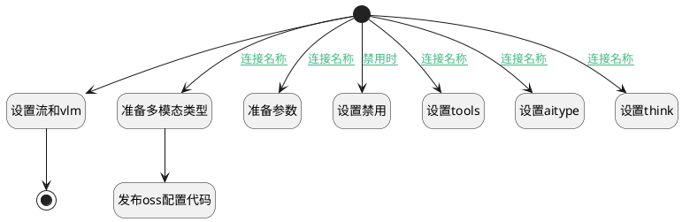

## 获取Cloud配置 <!-- {docsify-ignore-all} -->

   

### 处理过程




### 处理步骤说明

#### 设置流和vlm :id=PREPAREPARAM_02<sup class="footnote-symbol"> <font color=gray size=1>[准备参数]</font></sup>


1. 将`true` 设置给  `map.descossimage`

#### 结束 :id=END_01<sup class="footnote-symbol"> <font color=gray size=1>[结束]</font></sup>


返回 `map`

#### 开始 :id=Begin<sup class="footnote-symbol"> <font color=gray size=1>[开始]</font></sup>


*- N/A*
#### 准备多模态类型 :id=PREPAREPARAM_07<sup class="footnote-symbol"> <font color=gray size=1>[准备参数]</font></sup>


1. 将`QWENVL` 设置给  `map.aitype`

#### 发布oss配置代码 :id=RAWSFCODE_01<sup class="footnote-symbol"> <font color=gray size=1>[直接后台代码]</font></sup>


<p class="panel-title"><b>执行代码[Groovy]</b></p>

```groovy
net.ibizsys.central.cloud.core.spring.rt.ServiceHub.getInstance().publishConfig("cloud-oss","aiimage:\n  agent: ${sys.getDeploySystemId()}-ai--vl");
```

#### 准备参数 :id=PREPAREPARAM_06<sup class="footnote-symbol"> <font color=gray size=1>[准备参数]</font></sup>


1. 将`true` 设置给  `map.stream`

#### 设置禁用 :id=PREPAREPARAM_01<sup class="footnote-symbol"> <font color=gray size=1>[准备参数]</font></sup>


1. 将`1` 设置给  `map.disabled`

#### 设置tools :id=PREPAREPARAM_04<sup class="footnote-symbol"> <font color=gray size=1>[准备参数]</font></sup>


1. 将`true` 设置给  `map.tools`
2. 将`20` 设置给  `map.toolmaxcalls`

#### 设置aitype :id=PREPAREPARAM_05<sup class="footnote-symbol"> <font color=gray size=1>[准备参数]</font></sup>


1. 将`deepseek` 设置给  `map.aitype`

#### 设置think :id=PREPAREPARAM_03<sup class="footnote-symbol"> <font color=gray size=1>[准备参数]</font></sup>


1. 将`true` 设置给  `map.think`


### 连接条件说明
#### 连接名称 :id=Begin-PREPAREPARAM_03

`Default(传入变量).MODEL_CAPABILITY(模型能力)` LIKE `reasoning`
#### 连接名称 :id=Begin-PREPAREPARAM_04

`Default(传入变量).MODEL_CAPABILITY(模型能力)` LIKE `function_calling`
#### 连接名称 :id=Begin-PREPAREPARAM_05

`Default(传入变量).API_BASE_URL(模型 API 地址)` EQ `https://api.deepseek.com`
#### 连接名称 :id=Begin-PREPAREPARAM_06

`Default(传入变量).MODEL_CAPABILITY(模型能力)` LIKE `streaming`
#### 连接名称 :id=Begin-PREPAREPARAM_07

`Default(传入变量).MODEL_CATEGORY(模型类别)` EQ `vision`
#### 禁用时 :id=Begin-PREPAREPARAM_01

`Default(传入变量).ACTIVE(启用该模型)` EQ `0`


### 实体逻辑参数

|    中文名   |    代码名    |  数据类型    |  实体   |备注 |
| --------| --------| -------- | -------- | --------   |
|传入变量(<i class="fa fa-check"/></i>)|Default|数据对象|[AI大模型(AI_MODEL)](module/ai/ai_model.md)||
|map|map|数据对象|||
