## 钉钉部门标识(DDDEPTID) <!-- {docsify-ignore-all} -->

   

### 默认规则 :id=Default

```plantuml
@startuml
hide empty description
<style>
root {
  HyperlinkColor #42b983
}
</style>

state "start" as start  <<start>>
state "end" as end <<end>>
state "默认字符串长度" as 6434bda003e01d0d32e360b9e3a9d97e [[$./DDDeptId#a6434bda003e01d0d32e360b9e3a9d97e {"默认字符串长度"}]]


start --> 6434bda003e01d0d32e360b9e3a9d97e 
6434bda003e01d0d32e360b9e3a9d97e --> end 


@enduml
```

#### 条件说明

##### 默认字符串长度 :id=a6434bda003e01d0d32e360b9e3a9d97e

*关键条件*

`DDDEPTID(钉钉部门标识)` 属性长度在区间 `(0 , 100]` 内

> [!ATTENTION|label:规则信息|icon:fa fa-warning]
> 内容长度必须小于等于[100]

