## 分管领导标识(LEADERID) <!-- {docsify-ignore-all} -->

   

### 默认规则 :id=Default

```plantuml
@startuml
hide empty description
<style>
root {
  HyperlinkColor #42b983
}
</style>

state "start" as start  <<start>>
state "end" as end <<end>>
state "默认字符串长度" as de6f5ca2467f5ff93b55661da3f4ab31 [[$./LeaderId#ade6f5ca2467f5ff93b55661da3f4ab31 {"默认字符串长度"}]]


start --> de6f5ca2467f5ff93b55661da3f4ab31 
de6f5ca2467f5ff93b55661da3f4ab31 --> end 


@enduml
```

#### 条件说明

##### 默认字符串长度 :id=ade6f5ca2467f5ff93b55661da3f4ab31

*关键条件*

`LEADERID(分管领导标识)` 属性长度在区间 `(0 , 500]` 内

> [!ATTENTION|label:规则信息|icon:fa fa-warning]
> 内容长度必须小于等于[500]

