## 用户工号(USERCODE) <!-- {docsify-ignore-all} -->

   

### 默认规则 :id=Default

```plantuml
@startuml
hide empty description
<style>
root {
  HyperlinkColor #42b983
}
</style>

state "start" as start  <<start>>
state "end" as end <<end>>
state "默认字符串长度" as 1163e07220281a4652bf3c9a10823c88 [[$./UserCode#a1163e07220281a4652bf3c9a10823c88 {"默认字符串长度"}]]


start --> 1163e07220281a4652bf3c9a10823c88 
1163e07220281a4652bf3c9a10823c88 --> end 


@enduml
```

#### 条件说明

##### 默认字符串长度 :id=a1163e07220281a4652bf3c9a10823c88

*关键条件*

`USERCODE(用户工号)` 属性长度在区间 `(0 , 100]` 内

> [!ATTENTION|label:规则信息|icon:fa fa-warning]
> 内容长度必须小于等于[100]

