## 获取关于信息 <!-- {docsify-ignore-all} -->

   

### 处理过程

```plantuml
@startuml
hide empty description
<style>
root {
  HyperlinkColor #42b983
}
</style>

hide empty description
state "开始" as Begin <<start>> [[$./GetAboutInfo#begin {"开始"}]]
state "执行脚本代码" as RAWSFCODE_01  [[$./GetAboutInfo#rawsfcode_01 {"执行脚本代码"}]]
state "调试关于" as DEBUGPARAM_01  [[$./GetAboutInfo#debugparam_01 {"调试关于"}]]
state "结束" as END1 <<end>> [[$./GetAboutInfo#end1 {"结束"}]]


Begin --> RAWSFCODE_01
RAWSFCODE_01 --> DEBUGPARAM_01
DEBUGPARAM_01 --> END1


@enduml
```




### 处理步骤说明

#### 开始 :id=Begin<sup class="footnote-symbol"> <font color=gray size=1>[开始]</font></sup>


*- N/A*
#### 执行脚本代码 :id=RAWSFCODE_01<sup class="footnote-symbol"> <font color=gray size=1>[直接后台代码]</font></sup>


<p class="panel-title"><b>执行代码[Groovy]</b></p>

```groovy
entity.set("name", sys.getPSSystem().getLogicName());
entity.set("version", sys.getPSSystem().getDefaultPSSysSFPub().getVersionString());
entity.set("id", sys.getDeploySystemId());
entity.set("description", sys.getPSSystem().getMemo());
entity.set("license", "MIT");
```

#### 调试关于 :id=DEBUGPARAM_01<sup class="footnote-symbol"> <font color=gray size=1>[调试逻辑参数]</font></sup>


> [!NOTE|label:调试信息|icon:fa fa-bug]
> 调试输出参数`Default(传入变量)`的详细信息


#### 结束 :id=END1<sup class="footnote-symbol"> <font color=gray size=1>[结束]</font></sup>


返回 `Default(传入变量)`


### 实体逻辑参数

|    中文名   |    代码名    |  数据类型    |  实体   |备注 |
| --------| --------| -------- | -------- | --------   |
|传入变量(<i class="fa fa-check"/></i>)|Default|数据对象|[关于(ABOUT)](module/extension/ABOUT.md)||
