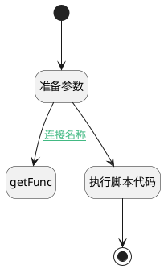

## versions <!-- {docsify-ignore-all} -->

   

### 处理过程




### 处理步骤说明

#### 开始 :id=Begin<sup class="footnote-symbol"> <font color=gray size=1>[开始]</font></sup>


*- N/A*
#### 准备参数 :id=PREPAREPARAM_01<sup class="footnote-symbol"> <font color=gray size=1>[准备参数]</font></sup>


1. 将`Default(传入变量)` 拷贝到  `func`

#### getFunc :id=DEACTION_01<sup class="footnote-symbol"> <font color=gray size=1>[实体行为]</font></sup>


调用实体 [核心产品功能(PSCOREPRDFUNC)](module/extension/PSCorePrdFunc.md) 行为 [Get](module/extension/PSCorePrdFunc#行为) ，行为参数为`func`

将执行结果返回给参数`func`

#### 执行脚本代码 :id=RAWSFCODE_01<sup class="footnote-symbol"> <font color=gray size=1>[直接后台代码]</font></sup>


<p class="panel-title"><b>执行代码[Groovy]</b></p>

```groovy
        def versions = logic.getParam("versions");
        if(entity.get("versions")  && entity.get("versions") instanceof List && ((List)entity.get("versions")).size()>0) {
            List list = ((List)entity.get("versions"));
            if(!"latest".equalsIgnoreCase(list.get(0).getOrDefault("version",""))) {
                Map latest = new HashMap();
                entity.copyTo(latest);
                versions.add(latest)
            }
            for(def ver:list) {
                Map item = new HashMap();
                entity.copyTo(item);
                item.putAll(ver);
                versions.add(item);
            }
        }
```

#### 结束 :id=END_01<sup class="footnote-symbol"> <font color=gray size=1>[结束]</font></sup>


返回 `versions`


### 连接条件说明
#### 连接名称 :id=PREPAREPARAM_01-DEACTION_01

`Default(传入变量).HTTPURLTOREPO(Http仓库地址)` ISNULL


### 实体逻辑参数

|    中文名   |    代码名    |  数据类型    |  实体   |备注 |
| --------| --------| -------- | -------- | --------   |
|传入变量(<i class="fa fa-check"/></i>)|Default|过滤器|||
|func|func|数据对象|[核心产品功能(PSCOREPRDFUNC)](module/extension/PSCorePrdFunc.md)||
|versions|versions|数据对象列表|||
