## clone此应用 <!-- {docsify-ignore-all} -->

   

### 处理过程

```plantuml
@startuml
hide footbox
<style>
root {
  HyperlinkColor #42b983
}
</style>

hide empty description
state "开始" as Begin <<start>> [[$./clone_git#begin {开始}]]
state "注入脚本代码" as RAWJSCODE1  [[$./clone_git#rawjscode1 {注入脚本代码}]]


Begin --> RAWJSCODE1


@enduml
```




### 处理步骤说明

#### 开始 :id=Begin<sup class="footnote-symbol"> <font color=gray size=1>[开始]</font></sup>


#### 注入脚本代码 :id=RAWJSCODE1<sup class="footnote-symbol"> <font color=gray size=1>[直接前台代码]</font></sup>


<p class="panel-title"><b>执行代码</b></p>

```javascript
var { httpurltorepo } = uiLogic.default;

var aux = document.createElement("textarea");
// aux.setAttribute("value", info); 
aux.value='git clone ' + httpurltorepo;
document.body.appendChild(aux); 
aux.select(); 
document.execCommand("copy"); 
document.body.removeChild(aux); 

util.message.success('复制成功!');
```


### 实体逻辑参数

|    中文名   |    代码名    |  数据类型      |备注 |
| --------| --------| --------  | --------   |
|传入变量(<i class="fa fa-check"/></i>)|Default|数据对象||
