## 自定义版本安装 <!-- {docsify-ignore-all} -->

   

### 处理过程

```plantuml
@startuml
hide footbox
<style>
root {
  HyperlinkColor #42b983
}
</style>

hide empty description
state "开始" as Begin <<start>> [[$./custom_version_info#begin {开始}]]
state "指定版本安装" as DEUIACTION_01  [[$./custom_version_info#deuiaction_01 {指定版本安装}]]
state "注入脚本代码" as RAWJSCODE_01  [[$./custom_version_info#rawjscode_01 {注入脚本代码}]]
state "结束" as END_01 <<end>> [[$./custom_version_info#end_01 {结束}]]


Begin --> DEUIACTION_01
DEUIACTION_01 --> RAWJSCODE_01
RAWJSCODE_01 --> END_01


@enduml
```




### 处理步骤说明

#### 开始 :id=Begin<sup class="footnote-symbol"> <font color=gray size=1>[开始]</font></sup>


#### 指定版本安装 :id=DEUIACTION_01<sup class="footnote-symbol"> <font color=gray size=1>[实体界面行为调用]</font></sup>


调用实体 [核心产品功能(PSCOREPRDFUNC)](module/extension/PSCorePrdFunc.md) 界面行为 [指定版本安装](module/extension/PSCorePrdFunc#界面行为) ，行为参数为`Default(传入变量)`

#### 注入脚本代码 :id=RAWJSCODE_01<sup class="footnote-symbol"> <font color=gray size=1>[直接前台代码]</font></sup>


<p class="panel-title"><b>执行代码</b></p>

```javascript
console.log("custom version execed");
// ibiz.mc.command.create.send({ srfdecodename: 'PSCorePrdFunc'}, { triggerKey: 'specinstallbtn' });
if(view && view.parentView ){
    await view.parentView.callUIAction('Refresh');
}
```

#### 结束 :id=END_01<sup class="footnote-symbol"> <font color=gray size=1>[结束]</font></sup>


### 实体逻辑参数

|    中文名   |    代码名    |  数据类型      |备注 |
| --------| --------| --------  | --------   |
|传入变量(<i class="fa fa-check"/></i>)|Default|数据对象||
