## 初始化插件信息 <!-- {docsify-ignore-all} -->

   进入扩展设置时，从setting中获取插件标识和插件库

### 处理过程

```plantuml
@startuml
hide footbox
<style>
root {
  HyperlinkColor #42b983
}
</style>

hide empty description
state "开始" as Begin <<start>> [[$./init_plugin_info#begin {开始}]]
state "初始化" as RAWJSCODE1  [[$./init_plugin_info#rawjscode1 {初始化}]]


Begin --> RAWJSCODE1


@enduml
```




### 处理步骤说明

#### 开始 :id=Begin<sup class="footnote-symbol"> <font color=gray size=1>[开始]</font></sup>


#### 初始化 :id=RAWJSCODE1<sup class="footnote-symbol"> <font color=gray size=1>[直接前台代码]</font></sup>


<p class="panel-title"><b>执行代码</b></p>

```javascript
var data = uiLogic.form.state.data;
var setting_json = JSON.parse(data.settings, null, 4);
data.rt_object_repo = setting_json.rTObjectRepo || "";
data.plugin_code = setting_json.pluginCode || "";
```


### 实体逻辑参数

|    中文名   |    代码名    |  数据类型      |备注 |
| --------| --------| --------  | --------   |
|form|form|部件对象||
|view|view|当前视图对象||
|传入变量(<i class="fa fa-check"/></i>)|Default|数据对象||
