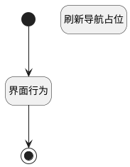

## 跳转应用详情页面 <!-- {docsify-ignore-all} -->

   

### 处理过程




### 处理步骤说明

#### 开始 :id=Begin<sup class="footnote-symbol"> <font color=gray size=1>[开始]</font></sup>


#### 结束 :id=END1<sup class="footnote-symbol"> <font color=gray size=1>[结束]</font></sup>


#### 界面行为 :id=DEUIACTION1<sup class="footnote-symbol"> <font color=gray size=1>[实体界面行为调用]</font></sup>


调用实体 [核心产品功能(PSCOREPRDFUNC)](module/extension/PSCorePrdFunc.md) 界面行为 [打开卡片详情页面](module/extension/PSCorePrdFunc#界面行为) ，行为参数为`Default(传入变量)`

#### 刷新导航占位 :id=RAWJSCODE1<sup class="footnote-symbol"> <font color=gray size=1>[直接前台代码]</font></sup>


<p class="panel-title"><b>执行代码</b></p>

```javascript
setTimeout(() => {
  parentView.layoutPanel.panelItems.nav_pos.openView({
    key: uiLogic.default.pscoreprdfuncid,
    viewId: 'plmweb.ps_core_prd_func_info_view',
    isRoutePushed: true,
  });
}, 0);
```


### 实体逻辑参数

|    中文名   |    代码名    |  数据类型      |备注 |
| --------| --------| --------  | --------   |
|cvt|cvt|当前部件对象||
|传入变量(<i class="fa fa-check"/></i>)|Default|数据对象||
