## 更新插件设置 <!-- {docsify-ignore-all} -->

   插件库更改后，更新setting字段

### 处理过程

```plantuml
@startuml
hide footbox
<style>
root {
  HyperlinkColor #42b983
}
</style>

hide empty description
state "开始" as Begin <<start>> [[$./update_plugin_setting#begin {开始}]]
state "更新settings字段" as RAWJSCODE1  [[$./update_plugin_setting#rawjscode1 {更新settings字段}]]


Begin --> RAWJSCODE1


@enduml
```




### 处理步骤说明

#### 开始 :id=Begin<sup class="footnote-symbol"> <font color=gray size=1>[开始]</font></sup>


#### 更新settings字段 :id=RAWJSCODE1<sup class="footnote-symbol"> <font color=gray size=1>[直接前台代码]</font></sup>


<p class="panel-title"><b>执行代码</b></p>

```javascript
var rt_object_repo = uiLogic.default.rt_object_repo;
var data = uiLogic.form.state.data;
var setting_json = JSON.parse(data.settings);
setting_json.rTObjectRepo = rt_object_repo;
data.settings = JSON.stringify(setting_json, null, 4);
```


### 实体逻辑参数

|    中文名   |    代码名    |  数据类型      |备注 |
| --------| --------| --------  | --------   |
|传入变量(<i class="fa fa-check"/></i>)|Default|数据对象||
|form|form|部件对象||
