## 从模板建立规则 <!-- {docsify-ignore-all} -->

   从模板建立规则

### 处理过程

```plantuml
@startuml
hide empty description
<style>
root {
  HyperlinkColor #42b983
}
</style>

hide empty description
state "开始" as Begin <<start>> [[$./create_by_template#begin {"开始"}]]
state "获取数据" as DEACTION2  [[$./create_by_template#deaction2 {"获取数据"}]]
state "变更实体标识" as PREPAREPARAM1  [[$./create_by_template#prepareparam1 {"变更实体标识"}]]
state "建立规则" as DEACTION1  [[$./create_by_template#deaction1 {"建立规则"}]]
state "结束" as END1 <<end>> [[$./create_by_template#end1 {"结束"}]]


Begin --> DEACTION2
DEACTION2 --> PREPAREPARAM1
PREPAREPARAM1 --> DEACTION1
DEACTION1 --> END1


@enduml
```

### 处理步骤说明

#### 开始 :id=Begin [开始]

*- N/A*
#### 获取数据 :id=DEACTION2 [实体行为]

调用实体 [实体处理逻辑(PSDELOGIC)](module/extension/PSDELogic.md) 行为 [Get](module/extension/PSDELogic#行为) ，行为参数为`Default(传入变量)`

将执行结果返回给参数`Default(传入变量)`

#### 变更实体标识 :id=PREPAREPARAM1 [准备参数]

1. 将`Base.common_flow` 设置给  `Default(传入变量).PSDEID(实体)`

#### 建立规则 :id=DEACTION1 [实体行为]

调用实体 [实体处理逻辑(PSDELOGIC)](module/extension/PSDELogic.md) 行为 [Create](module/extension/PSDELogic#行为) ，行为参数为`Default(传入变量)`

#### 结束 :id=END1 [结束]

*- N/A*

### 实体逻辑参数

|    中文名   |    代码名    |  数据类型    |  实体   |备注 |
| --------| --------| -------- | -------- | --------   |
|传入变量(<i class="fa fa-check"/></i>)|Default|数据对象|[实体处理逻辑(PSDELOGIC)](module/extension/PSDELogic.md)||
