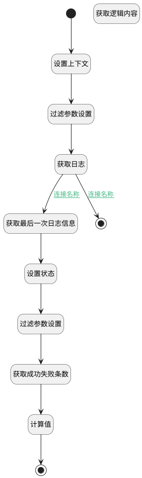

## 获取最后运行状态 <!-- {docsify-ignore-all} -->

   获取最后运行状态

### 处理过程




### 处理步骤说明

#### 开始 :id=Begin<sup class="footnote-symbol"> <font color=gray size=1>[开始]</font></sup>


*- N/A*
#### 设置上下文 :id=PREPAREPARAM1<sup class="footnote-symbol"> <font color=gray size=1>[准备参数]</font></sup>


1. 将`Default(传入变量).psdelogicid(实体处理逻辑标识)` 设置给  `context(上下文).psdelogic`

#### 获取逻辑内容 :id=DEACTION1<sup class="footnote-symbol"> <font color=gray size=1>[实体行为]</font></sup>


调用实体 [实体处理逻辑(PSDELOGIC)](module/extension/PSDELogic.md) 行为 [Get](module/extension/PSDELogic#行为) ，行为参数为`context(上下文)`

将执行结果返回给参数`Default(传入变量)`

#### 过滤参数设置 :id=PREPAREPARAM2<sup class="footnote-symbol"> <font color=gray size=1>[准备参数]</font></sup>


1. 将`context(上下文).psdelogic` 设置给  `logic_log_filter(逻辑记录).n_owner_id_eq`
2. 将`start_at,desc` 设置给  `logic_log_filter(逻辑记录).sort`

#### 获取日志 :id=DEDATASET1<sup class="footnote-symbol"> <font color=gray size=1>[实体数据集]</font></sup>


调用实体 [扩展日志(EXTEND_LOG)](module/Base/extend_log.md) 数据集合 [数据集(DEFAULT)](module/Base/extend_log#数据集合) ，查询参数为`logic_log_filter(逻辑记录)`

将执行结果返回给参数`logs(日志数组)`

#### 获取最后一次日志信息 :id=BINDPARAM1<sup class="footnote-symbol"> <font color=gray size=1>[绑定参数]</font></sup>


绑定参数`logs(日志数组)` 到 `logic_log(最新日志)`
#### 设置状态 :id=PREPAREPARAM3<sup class="footnote-symbol"> <font color=gray size=1>[准备参数]</font></sup>


1. 将`logic_log(最新日志).START_AT(起始时间)` 设置给  `Default(传入变量).LAST_START_AT(最后运行时间)`
2. 将`logic_log(最新日志).STATE(状态)` 设置给  `Default(传入变量).LAST_STATE(最后运行状态)`

#### 结束 :id=END2<sup class="footnote-symbol"> <font color=gray size=1>[结束]</font></sup>


返回 `Default(传入变量)`

#### 过滤参数设置 :id=PREPAREPARAM4<sup class="footnote-symbol"> <font color=gray size=1>[准备参数]</font></sup>


1. 将`1000` 设置给  `logic_log_filter2(分组过滤器).size`
2. 将`context(上下文).psdelogic` 设置给  `logic_log_filter2(分组过滤器).n_owner_id_eq`

#### 结束 :id=END1<sup class="footnote-symbol"> <font color=gray size=1>[结束]</font></sup>


返回 `Default(传入变量)`

#### 获取成功失败条数 :id=DEDATASET2<sup class="footnote-symbol"> <font color=gray size=1>[实体数据集]</font></sup>


调用实体 [扩展日志(EXTEND_LOG)](module/Base/extend_log.md) 数据集合 [执行情况统计(execution_statistics)](module/Base/extend_log#数据集合) ，查询参数为`logic_log_filter2(分组过滤器)`

将执行结果返回给参数`log_statistics(统计值)`

#### 计算值 :id=RAWSFCODE1<sup class="footnote-symbol"> <font color=gray size=1>[直接后台代码]</font></sup>


<p class="panel-title"><b>执行代码[JavaScript]</b></p>

```javascript
var staticfics = logic.getParam("log_statistics");
var defvar = logic.getParam("default");
var success_per = 0;
var success_count = 0;
var failure_count = 0;
for (var i = 0; i < staticfics.size(); i++) {
    var staticfic = staticfics.get(i); 
    if (staticfic.get("state") == "SUCCESS"){
        success_count = staticfic.get("count");
    }
    if (staticfic.get("state") == "FAILURE"){
        failure_count = staticfic.get("count");
    }
}
var total = success_count + failure_count;
success_per = (success_count / total) *100 ;
defvar.set("success_count",success_count);
defvar.set("failure_count",failure_count);
defvar.set("success_per",success_per);
defvar.set("total",total);
```


### 连接条件说明
#### 连接名称 :id=DEDATASET1-BINDPARAM1

`logs(日志数组).size` GT `0`
#### 连接名称 :id=DEDATASET1-END2

`logs(日志数组).size` EQ `0`


### 实体逻辑参数

|    中文名   |    代码名    |  数据类型    |  实体   |备注 |
| --------| --------| -------- | -------- | --------   |
|传入变量(<i class="fa fa-check"/></i>)|Default|数据对象|[实体处理逻辑(PSDELOGIC)](module/extension/PSDELogic.md)||
|上下文|context||||
|统计值|log_statistics|分页查询|||
|最新日志|logic_log|数据对象|[扩展日志(EXTEND_LOG)](module/Base/extend_log.md)||
|逻辑记录|logic_log_filter|过滤器|||
|分组过滤器|logic_log_filter2|过滤器|||
|日志数组|logs|分页查询|||
