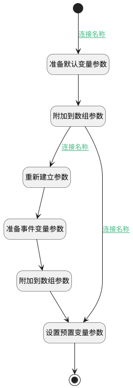

## 初始化规则 <!-- {docsify-ignore-all} -->

   

### 处理过程




### 处理步骤说明

#### 开始 :id=Begin<sup class="footnote-symbol"> <font color=gray size=1>[开始]</font></sup>


*- N/A*
#### 附加到数组参数 :id=APPENDPARAM_01<sup class="footnote-symbol"> <font color=gray size=1>[附加到数组参数]</font></sup>


将参数`delogicparam` 添加到数组参数`delogicparams(逻辑参数)`
#### 重新建立参数 :id=RENEWPARAM_01<sup class="footnote-symbol"> <font color=gray size=1>[重新建立参数]</font></sup>


重建参数```delogicparam(delogicparam)```
#### 准备默认变量参数 :id=PREPAREPARAM_01<sup class="footnote-symbol"> <font color=gray size=1>[准备参数]</font></sup>


1. 将`default` 设置给  `delogicparam.PSDELOGICPARAMID(实体逻辑参数标识)`
2. 将`DEFAULT` 设置给  `delogicparam.PSDELOGICPARAMNAME(参数标识)`
3. 将`1` 设置给  `delogicparam.DEFAULTPARAM(默认变量)`
4. 将`0` 设置给  `delogicparam.GLOBALPARAM(变量类别)`
5. 将`默认变量` 设置给  `delogicparam.LOGICNAME(中文名称)`
6. 将`1` 设置给  `delogicparam.ORIGINENTITYFLAG(原始数据对象)`

#### 准备事件变量参数 :id=PREPAREPARAM_02<sup class="footnote-symbol"> <font color=gray size=1>[准备参数]</font></sup>


1. 将`eventdata` 设置给  `delogicparam.PSDELOGICPARAMID(实体逻辑参数标识)`
2. 将`EVENTDATA` 设置给  `delogicparam.PSDELOGICPARAMNAME(参数标识)`
3. 将`0` 设置给  `delogicparam.DEFAULTPARAM(默认变量)`
4. 将`0` 设置给  `delogicparam.GLOBALPARAM(变量类别)`
5. 将`事件变量` 设置给  `delogicparam.LOGICNAME(中文名称)`
6. 将`1` 设置给  `delogicparam.ORIGINENTITYFLAG(原始数据对象)`

#### 附加到数组参数 :id=APPENDPARAM_02<sup class="footnote-symbol"> <font color=gray size=1>[附加到数组参数]</font></sup>


将参数`delogicparam` 添加到数组参数`delogicparams(逻辑参数)`
#### 设置预置变量参数 :id=PREPAREPARAM_03<sup class="footnote-symbol"> <font color=gray size=1>[准备参数]</font></sup>


1. 将`delogicparams(逻辑参数)` 设置给  `Default(传入变量).PSDELOGICPARAMS(逻辑参数)`

#### 结束 :id=END_01<sup class="footnote-symbol"> <font color=gray size=1>[结束]</font></sup>


返回 `Default(传入变量)`


### 连接条件说明
#### 连接名称 :id=Begin-PREPAREPARAM_01

`Default(传入变量).PSDELOGICPARAMS(逻辑参数)` ISNULL
#### 连接名称 :id=APPENDPARAM_01-RENEWPARAM_01

`Default(传入变量).LOGICSUBTYPE(逻辑子类)` EQ `EVENTHOOK`
#### 连接名称 :id=APPENDPARAM_01-PREPAREPARAM_03

`Default(传入变量).LOGICSUBTYPE(逻辑子类)` NOTEQ `EVENTHOOK`


### 实体逻辑参数

|    中文名   |    代码名    |  数据类型    |  实体   |备注 |
| --------| --------| -------- | -------- | --------   |
|传入变量(<i class="fa fa-check"/></i>)|Default|数据对象|[实体处理逻辑(PSDELOGIC)](module/extension/PSDELogic.md)||
|delogicparam|delogicparam|数据对象|[实体逻辑参数(PSDELOGICPARAM)](module/extension/PSDELogicParam.md)||
|逻辑参数|delogicparams|数据对象列表|[实体逻辑参数(PSDELOGICPARAM)](module/extension/PSDELogicParam.md)||
