## 测试模板规则 <!-- {docsify-ignore-all} -->

   

### 处理过程

```plantuml
@startuml
hide empty description
<style>
root {
  HyperlinkColor #42b983
}
</style>

hide empty description
state "开始" as Begin <<start>> [[$./test_template_flow#begin {"开始"}]]
state "测试模板规则" as DELOGIC1  [[$./test_template_flow#delogic1 {"测试模板规则"}]]
state "结束" as END1 <<end>> [[$./test_template_flow#end1 {"结束"}]]


Begin --> DELOGIC1
DELOGIC1 --> END1


@enduml
```

### 处理步骤说明

#### 开始 :id=Begin [开始]

*- N/A*
#### 测试模板规则 :id=DELOGIC1 [实体逻辑]

调用实体 [规则模板(TEMPLATE_FLOW)](module/Base/template_flow.md) 处理逻辑 [定时将已完成工作项归档]((module/Base/template_flow/logic/turn_work_item_archived.md)) ，行为参数为`Default(传入变量)`

#### 结束 :id=END1 [结束]

*- N/A*

### 实体逻辑参数

|    中文名   |    代码名    |  数据类型    |  实体   |备注 |
| --------| --------| -------- | -------- | --------   |
|传入变量(<i class="fa fa-check"/></i>)|Default|数据对象|[实体处理逻辑(PSDELOGIC)](module/extension/PSDELogic.md)||
