## 切换启用状态 <!-- {docsify-ignore-all} -->

   切换启用状态

### 处理过程

```plantuml
@startuml
hide empty description
<style>
root {
  HyperlinkColor #42b983
}
</style>

hide empty description
state "开始" as Begin <<start>> [[$./valid#begin {"开始"}]]
state "禁用" as DEACTION2  [[$./valid#deaction2 {"禁用"}]]
state "结束" as END1 <<end>> [[$./valid#end1 {"结束"}]]
state "启用" as DEACTION1  [[$./valid#deaction1 {"启用"}]]


Begin --> DEACTION1 : [[$./valid#begin-deaction1{连接名称} 连接名称]]
DEACTION1 --> END1
Begin --> DEACTION2 : [[$./valid#begin-deaction2{连接名称} 连接名称]]
DEACTION2 --> END1


@enduml
```

### 处理步骤说明

#### 开始 :id=Begin [开始]

*- N/A*
#### 禁用 :id=DEACTION2 [实体行为]

调用实体 [实体处理逻辑(PSDELOGIC)](module/extension/PSDELogic.md) 行为 [禁用(DISABLE)](module/extension/PSDELogic#行为) ，行为参数为`Default(传入变量)`

#### 结束 :id=END1 [结束]

*- N/A*

#### 启用 :id=DEACTION1 [实体行为]

调用实体 [实体处理逻辑(PSDELOGIC)](module/extension/PSDELogic.md) 行为 [启用(ENABLE)](module/extension/PSDELogic#行为) ，行为参数为`Default(传入变量)`

### 连接条件说明
#### 连接名称 :id=Begin-DEACTION1

`Default(传入变量).VALIDFLAG(启用)` EQ `1`
#### 连接名称 :id=Begin-DEACTION2

`Default(传入变量).VALIDFLAG(启用)` EQ `0`

### 实体逻辑参数

|    中文名   |    代码名    |  数据类型    |  实体   |备注 |
| --------| --------| -------- | -------- | --------   |
|传入变量(<i class="fa fa-check"/></i>)|Default|数据对象|[实体处理逻辑(PSDELOGIC)](module/extension/PSDELogic.md)||
