## 代码名称(CODENAME) <!-- {docsify-ignore-all} -->

   

### 默认规则 :id=Default

```plantuml
@startuml
hide empty description
<style>
root {
  HyperlinkColor #42b983
}
</style>

state "start" as start  <<start>>
state "end" as end <<end>>
state "默认字符串长度" as 54c26664ac34990d7a4142ab1237c609 [[$./CodeName#a54c26664ac34990d7a4142ab1237c609 {"默认字符串长度"}]]


start --> 54c26664ac34990d7a4142ab1237c609 
54c26664ac34990d7a4142ab1237c609 --> end 


@enduml
```

#### 条件说明

##### 默认字符串长度 :id=a54c26664ac34990d7a4142ab1237c609

*关键条件*

`CODENAME(代码名称)` 属性长度在区间 `(0 , 50]` 内

> [!ATTENTION|label:规则信息|icon:fa fa-warning]
> 内容长度必须小于等于[50]

