## 监控变化属性集(FIELDS) <!-- {docsify-ignore-all} -->

   

### 默认规则 :id=Default

```plantuml
@startuml
hide empty description
<style>
root {
  HyperlinkColor #42b983
}
</style>

state "start" as start  <<start>>
state "end" as end <<end>>
state "默认字符串长度" as ad93a25b68914b5a0d1e87eeb38bb025 [[$./Fields#aad93a25b68914b5a0d1e87eeb38bb025 {"默认字符串长度"}]]


start --> ad93a25b68914b5a0d1e87eeb38bb025 
ad93a25b68914b5a0d1e87eeb38bb025 --> end 


@enduml
```

#### 条件说明

##### 默认字符串长度 :id=aad93a25b68914b5a0d1e87eeb38bb025

*关键条件*

`FIELDS(监控变化属性集)` 属性长度在区间 `(0 , 1048576]` 内

> [!ATTENTION|label:规则信息|icon:fa fa-warning]
> 内容长度必须小于等于[1048576]

