## 延后通知间隔(NOTIFYEND) <!-- {docsify-ignore-all} -->

   

### 默认规则 :id=Default

```plantuml
@startuml
hide empty description
<style>
root {
  HyperlinkColor #42b983
}
</style>

state "start" as start  <<start>>
state "end" as end <<end>>
state "默认值范围" as 540a9f2a8e9b004d59570b35fc2f2772 [[$./NotifyEnd#a540a9f2a8e9b004d59570b35fc2f2772 {"默认值范围"}]]


start --> 540a9f2a8e9b004d59570b35fc2f2772 
540a9f2a8e9b004d59570b35fc2f2772 --> end 


@enduml
```

#### 条件说明

##### 默认值范围 :id=a540a9f2a8e9b004d59570b35fc2f2772

*关键条件*

`NOTIFYEND(延后通知间隔)` 值在区间 `
[-1440.0 , 1440.0]` 内

> [!ATTENTION|label:规则信息|icon:fa fa-warning]
> 数值必须大于等于[-1440]且小于等于[1440]

