## 更新报表 <!-- {docsify-ignore-all} -->

   

### 处理过程

```plantuml
@startuml
hide empty description
<style>
root {
  HyperlinkColor #42b983
}
</style>

hide empty description
state "开始" as Begin <<start>> [[$./update_report#begin {"开始"}]]
state "结束" as END1 <<end>> [[$./update_report#end1 {"结束"}]]
state "回填数据" as PREPAREPARAM1  [[$./update_report#prepareparam1 {"回填数据"}]]
state "回写图表类型" as RAWSFCODE1  [[$./update_report#rawsfcode1 {"回写图表类型"}]]
state "更新业务报表" as DEACTION1  [[$./update_report#deaction1 {"更新业务报表"}]]


Begin --> PREPAREPARAM1
PREPAREPARAM1 --> RAWSFCODE1
RAWSFCODE1 --> DEACTION1
DEACTION1 --> END1


@enduml
```




### 处理步骤说明

#### 开始 :id=Begin<sup class="footnote-symbol"> <font color=gray size=1>[开始]</font></sup>


*- N/A*
#### 结束 :id=END1<sup class="footnote-symbol"> <font color=gray size=1>[结束]</font></sup>


*- N/A*

#### 回填数据 :id=PREPAREPARAM1<sup class="footnote-symbol"> <font color=gray size=1>[准备参数]</font></sup>


1. 将`Default(传入变量).PSSYSBICUBEID(智能报表立方体)` 设置给  `insight_report(效能报表).GROUP(组别)`
2. 将`Default(传入变量).pssysbireportname(智能报表名称)` 设置给  `insight_report(效能报表).NAME(名称)`
3. 将`Default(传入变量).PSSYSBIREPORTID(智能报表标识)` 设置给  `insight_report(效能报表).ID(标识)`

#### 回写图表类型 :id=RAWSFCODE1<sup class="footnote-symbol"> <font color=gray size=1>[直接后台代码]</font></sup>


<p class="panel-title"><b>执行代码[JavaScript]</b></p>

```javascript
var _default = logic.getParam("Default");
var insight_report = logic.getParam("insight_report");
var str_uimodel = _default.get("bireportuimodel");
var uimodel = JSON.parse(str_uimodel);
var chart_type = uimodel.selectChartType;
insight_report.set("chart_type",chart_type);
insight_report.set("template_model",_default.dump());
```

#### 更新业务报表 :id=DEACTION1<sup class="footnote-symbol"> <font color=gray size=1>[实体行为]</font></sup>


调用实体 [效能报表(INSIGHT_REPORT)](module/Insight/insight_report.md) 行为 [Update](module/Insight/insight_report#行为) ，行为参数为`insight_report(效能报表)`


### 实体逻辑参数

|    中文名   |    代码名    |  数据类型    |  实体   |备注 |
| --------| --------| -------- | -------- | --------   |
|传入变量(<i class="fa fa-check"/></i>)|Default|数据对象|[智能报表(PSSYSBIREPORT)](module/extension/PSSysBIReport.md)||
|效能报表|insight_report|数据对象|[效能报表(INSIGHT_REPORT)](module/Insight/insight_report.md)||
