## 保存列表多数据部件 <!-- {docsify-ignore-all} -->

   保存列表多数据部件

### 处理过程

```plantuml
@startuml
hide footbox
<style>
root {
  HyperlinkColor #42b983
}
</style>

hide empty description
state "开始" as Begin <<start>> [[$./save_list_mdctrl#begin {开始}]]
state "准备列表服务" as PREPAREJSPARAM1  [[$./save_list_mdctrl#preparejsparam1 {准备列表服务}]]
state "更新列表数据" as RAWJSCODE1  [[$./save_list_mdctrl#rawjscode1 {更新列表数据}]]


Begin --> PREPAREJSPARAM1
PREPAREJSPARAM1 --> RAWJSCODE1


@enduml
```




### 处理步骤说明

#### 开始 :id=Begin<sup class="footnote-symbol"> <font color=gray size=1>[开始]</font></sup>


#### 准备列表服务 :id=PREPAREJSPARAM1<sup class="footnote-symbol"> <font color=gray size=1>[准备参数]</font></sup>


1. 将`setting_model_list(列表部件).service` 设置给  `listservice(列表服务)`

#### 更新列表数据 :id=RAWJSCODE1<sup class="footnote-symbol"> <font color=gray size=1>[直接前台代码]</font></sup>


<p class="panel-title"><b>执行代码</b></p>

```javascript
const list = uiLogic.setting_model_list;
const items = list.getAllData() || [];
if (uiLogic.listservice) {
    uiLogic.listservice.updateBatch(list.context, items).then((res) => {
        if (res.data) {
            list.setData(res.data);
        }
        list.evt.emit('onSaveSuccess', undefined);
    })
}
```


### 实体逻辑参数

|    中文名   |    代码名    |  数据类型      |备注 |
| --------| --------| --------  | --------   |
|列表部件|setting_model_list|部件对象||
|传入变量(<i class="fa fa-check"/></i>)|Default|数据对象||
|列表服务|listservice|数据对象||
