## 添加评论 <!-- {docsify-ignore-all} -->

   添加讨论中的评论信息

### 处理过程

```plantuml
@startuml
hide empty description
<style>
root {
  HyperlinkColor #42b983
}
</style>

hide empty description
state "开始" as Begin <<start>> [[$./send_comment#begin {"开始"}]]
state "准备评论数据" as PREPAREPARAM1  [[$./send_comment#prepareparam1 {"准备评论数据"}]]
state "添加评论" as DEACTION1  [[$./send_comment#deaction1 {"添加评论"}]]
state "结束" as END1 <<end>> [[$./send_comment#end1 {"结束"}]]


Begin --> PREPAREPARAM1
PREPAREPARAM1 --> DEACTION1
DEACTION1 --> END1


@enduml
```

### 处理步骤说明

#### 开始 :id=Begin [开始]

*- N/A*
#### 准备评论数据 :id=PREPAREPARAM1 [准备参数]

1. 将`Default(传入变量).principal_id` 设置给  `commnet(评论).PRINCIPAL_ID(评论主体标识)`
2. 将`Default(传入变量).content(讨论内容)` 设置给  `commnet(评论).CONTENT(内容)`
3. 将`DISCUSS_POST` 设置给  `commnet(评论).OWNER_TYPE(所属数据对象)`
4. 将`DISCUSS_POST` 设置给  `commnet(评论).PRINCIPAL_TYPE(评论主体类型)`

#### 添加评论 :id=DEACTION1 [实体行为]

调用实体 [评论(COMMENT)](module/Base/comment.md) 行为 [Save](module/Base/comment#行为) ，行为参数为`commnet(评论)`

将执行结果返回给参数`commnet(评论)`

#### 结束 :id=END1 [结束]

返回 `commnet(评论)`

### 实体逻辑参数

|    中文名   |    代码名    |  数据类型    |  实体   |备注 |
| --------| --------| -------- | -------- | --------   |
|传入变量(<i class="fa fa-check"/></i>)|Default|数据对象|[讨论(DISCUSS_POST)](module/Team/discuss_post.md)||
|评论|commnet|数据对象|[评论(COMMENT)](module/Base/comment.md)||
