## 删除回复 <!-- {docsify-ignore-all} -->

   删除回复

### 处理过程

```plantuml
@startuml
hide footbox
<style>
root {
  HyperlinkColor #42b983
}
</style>

hide empty description
state "开始" as Begin <<start>> [[$./remove_reply#begin {开始}]]
state "删除回复" as DEACTION1  [[$./remove_reply#deaction1 {删除回复}]]
state "准备参数" as PREPAREJSPARAM1  [[$./remove_reply#preparejsparam1 {准备参数}]]


Begin --> PREPAREJSPARAM1
PREPAREJSPARAM1 --> DEACTION1


@enduml
```

### 处理步骤说明

#### 开始 :id=Begin [开始]

#### 准备参数 :id=PREPAREJSPARAM1 [准备参数]

1. 将`Default(传入变量).id` 设置给  `reply(回复).id`
2. 将`Default(传入变量).post_id` 设置给  `reply(回复).post_id`

#### 删除回复 :id=DEACTION1 [实体行为]

调用实体 [讨论回复(DISCUSS_REPLY)](module/Team/discuss_reply.md) 行为 [删除回复(del_reply)](module/Team/discuss_reply#行为) ，行为参数为`reply(回复)`

### 实体逻辑参数

|    中文名   |    代码名    |  数据类型      |备注 |
| --------| --------| --------  | --------   |
|回复|reply|数据对象||
|传入变量(<i class="fa fa-check"/></i>)|Default|数据对象||
