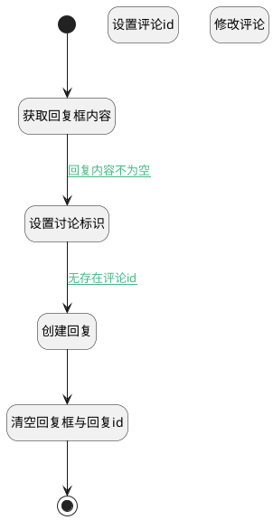

## 添加回复 <!-- {docsify-ignore-all} -->

   添加回复，并关闭回复输入框

### 处理过程




### 处理步骤说明

#### 开始 :id=Begin<sup class="footnote-symbol"> <font color=gray size=1>[开始]</font></sup>


#### 获取回复框内容 :id=RAWJSCODE1<sup class="footnote-symbol"> <font color=gray size=1>[直接前台代码]</font></sup>


<p class="panel-title"><b>执行代码</b></p>

```javascript
uiLogic.discuss_reply.content = uiLogic.view.layoutPanel.panelItems.field_textbox.value;
```

#### 设置讨论标识 :id=PREPAREJSPARAM1<sup class="footnote-symbol"> <font color=gray size=1>[准备参数]</font></sup>


1. 将`ctx(应用上下文变量).discuss_post` 设置给  `discuss_reply(讨论回复).post_id`
2. 将`view(当前视图对象).layoutPanel.panelItems.field_textbox.editor` 设置给  `editor(编辑器)`

#### 设置评论id :id=PREPAREJSPARAM3<sup class="footnote-symbol"> <font color=gray size=1>[准备参数]</font></sup>


1. 将`view(当前视图对象).edit_comment_id` 设置给  `comment(评论对象).id`
2. 将`view(当前视图对象).edit_comment_id` 设置给  `ctx(应用上下文变量).comment`

#### 创建回复 :id=DEACTION2<sup class="footnote-symbol"> <font color=gray size=1>[实体行为]</font></sup>


调用实体 [讨论回复(DISCUSS_REPLY)](module/Team/discuss_reply.md) 行为 [Create](module/Team/discuss_reply#行为) ，行为参数为`discuss_reply(讨论回复)`

#### 修改评论 :id=DEACTION3<sup class="footnote-symbol"> <font color=gray size=1>[实体行为]</font></sup>


调用实体 [讨论回复(DISCUSS_REPLY)](module/Team/discuss_reply.md) 行为 [Update](module/Team/discuss_reply#行为) ，行为参数为`comment(评论对象)`

#### 清空回复框与回复id :id=RAWJSCODE2<sup class="footnote-symbol"> <font color=gray size=1>[直接前台代码]</font></sup>


<p class="panel-title"><b>执行代码</b></p>

```javascript
uiLogic.view.layoutPanel.panelItems.field_textbox.value = '';
uiLogic.view.layoutPanel.panelItems.field_textbox.data.field_textbox = '';
uiLogic.view.edit_comment_id = null;
uiLogic.editor.reply.value = null;
uiLogic.editor.toggleCollapse(false)

```

#### 结束 :id=END1<sup class="footnote-symbol"> <font color=gray size=1>[结束]</font></sup>


### 连接条件说明
#### 回复内容不为空 :id=RAWJSCODE1-PREPAREJSPARAM1

```discuss_reply(讨论回复).content``` ISNOTNULL
#### 无存在评论id :id=PREPAREJSPARAM1-DEACTION2

```view(当前视图对象).edit_comment_id``` ISNULL


### 实体逻辑参数

|    中文名   |    代码名    |  数据类型      |备注 |
| --------| --------| --------  | --------   |
|编辑器|editor|数据对象||
|讨论回复|discuss_reply|数据对象||
|评论对象|comment|数据对象||
|传入变量(<i class="fa fa-check"/></i>)|Default|数据对象||
|应用上下文变量|ctx|导航视图参数绑定参数||
|当前视图对象|view|当前视图对象||
