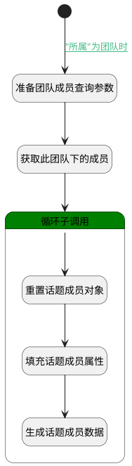

## 自动创建人员 <!-- {docsify-ignore-all} -->

   当所属选择"团队"时，点击完成后自动添加团队下的所有成员。

### 处理过程




### 处理步骤说明

#### 开始 :id=Begin<sup class="footnote-symbol"> <font color=gray size=1>[开始]</font></sup>


*- N/A*
#### 准备团队成员查询参数 :id=PREPAREPARAM1<sup class="footnote-symbol"> <font color=gray size=1>[准备参数]</font></sup>


1. 将`Default(传入变量).SCOPE_ID(所属对象)` 设置给  `member_filter(团队成员过滤器).n_owner_id_eq`
2. 将`GROUP` 设置给  `member_filter(团队成员过滤器).n_owner_type_eq`

#### 获取此团队下的成员 :id=DEDATASET1<sup class="footnote-symbol"> <font color=gray size=1>[实体数据集]</font></sup>


调用实体 [成员(MEMBER)](module/Base/member.md) 数据集合 [数据集(DEFAULT)](module/Base/member#数据集合) ，查询参数为`member_filter(团队成员过滤器)`

将执行结果返回给参数`member_page(团队成员查询结果变量)`

#### 循环子调用 :id=LOOPSUBCALL1<sup class="footnote-symbol"> <font color=gray size=1>[循环子调用]</font></sup>


循环参数`member_page(团队成员查询结果变量)`，子循环参数使用`for_member_obj(成员循环变量)`
#### 重置话题成员对象 :id=RESETPARAM1<sup class="footnote-symbol"> <font color=gray size=1>[重置参数]</font></sup>


重置参数```discuss_member(话题成员)```
#### 填充话题成员属性 :id=PREPAREPARAM2<sup class="footnote-symbol"> <font color=gray size=1>[准备参数]</font></sup>


1. 将`for_member_obj(成员循环变量).USER_ID(登录名)` 设置给  `discuss_member(话题成员).USER_ID(登录名)`
2. 将`for_member_obj(成员循环变量).ROLE_ID(角色)` 设置给  `discuss_member(话题成员).ROLE_ID(角色)`
3. 将`for_member_obj(成员循环变量).NAME(名称)` 设置给  `discuss_member(话题成员).NAME(名称)`
4. 将`Default(传入变量).ID(标识)` 设置给  `discuss_member(话题成员).OWNER_ID(话题标识)`
5. 将`DISCUSS` 设置给  `discuss_member(话题成员).OWNER_TYPE(所属数据对象)`
6. 将`DISCUSS` 设置给  `discuss_member(话题成员).OWNER_SUBTYPE(所属对象子类型)`

#### 生成话题成员数据 :id=DEACTION1<sup class="footnote-symbol"> <font color=gray size=1>[实体行为]</font></sup>


调用实体 [协作成员(DISCUSS_MEMBER)](module/Team/discuss_member.md) 行为 [Save](module/Team/discuss_member#行为) ，行为参数为`discuss_member(话题成员)`


### 连接条件说明
#### "所属"为团队时 :id=Begin-PREPAREPARAM1

`Default(传入变量).SCOPE_TYPE(所属)` EQ `user_group`


### 实体逻辑参数

|    中文名   |    代码名    |  数据类型    |  实体   |备注 |
| --------| --------| -------- | -------- | --------   |
|传入变量(<i class="fa fa-check"/></i>)|Default|数据对象|[话题(DISCUSS_TOPIC)](module/Team/discuss_topic.md)||
|话题成员|discuss_member|数据对象|[协作成员(DISCUSS_MEMBER)](module/Team/discuss_member.md)||
|成员循环变量|for_member_obj|数据对象|[成员(MEMBER)](module/Base/member.md)||
|团队成员过滤器|member_filter|过滤器|||
|团队成员查询结果变量|member_page|分页查询|||
