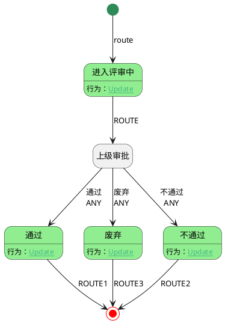

# 用例评审 <!-- {docsify-ignore-all} -->

测试用

## 用例评审 v1

### 流程图

### 审批步骤

|    序号 |    审批步骤   |    审批人     |
| -------- | --------   |------------|
|1|开始事件||
|2|通过||
|3|进入评审中||
|4|上级审批||
|5|废弃||
|6|结束事件||
|7|不通过||

