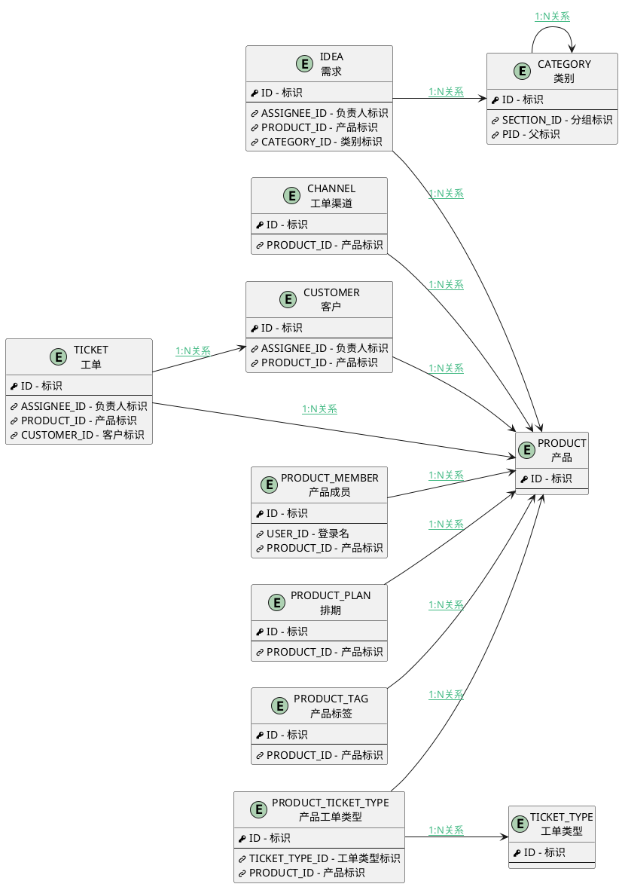

# 产品管理 <!-- {docsify-ignore-all} -->

```plantuml
@startuml
<style>
root {
  HyperlinkColor #42b983
}
</style>
left to right direction

entity "CATEGORY\n类别" as CATEGORY [[$../module/Base/Category {类别}]] {
        <&key> ID - 标识
        --
        <&link-intact> SECTION_ID - 分组标识
        <&link-intact> PID - 父标识
}
entity "CHANNEL\n工单渠道" as CHANNEL [[$../module/ProdMgmt/Channel {工单渠道}]] {
        <&key> ID - 标识
        --
        <&link-intact> PRODUCT_ID - 产品标识
}
entity "CUSTOMER\n客户" as CUSTOMER [[$../module/ProdMgmt/Customer {客户}]] {
        <&key> ID - 标识
        --
        <&link-intact> ASSIGNEE_ID - 负责人标识
        <&link-intact> PRODUCT_ID - 产品标识
}
entity "IDEA\n需求" as IDEA [[$../module/ProdMgmt/Idea {需求}]] {
        <&key> ID - 标识
        --
        <&link-intact> ASSIGNEE_ID - 负责人标识
        <&link-intact> PRODUCT_ID - 产品标识
        <&link-intact> CATEGORY_ID - 类别标识
}
entity "PRODUCT\n产品" as PRODUCT [[$../module/ProdMgmt/Product {产品}]] {
        <&key> ID - 标识
        --
}
entity "PRODUCT_MEMBER\n产品成员" as PRODUCT_MEMBER [[$../module/ProdMgmt/Product_member {产品成员}]] {
        <&key> ID - 标识
        --
        <&link-intact> USER_ID - 登录名
        <&link-intact> PRODUCT_ID - 产品标识
}
entity "PRODUCT_PLAN\n排期" as PRODUCT_PLAN [[$../module/ProdMgmt/Product_plan {排期}]] {
        <&key> ID - 标识
        --
        <&link-intact> PRODUCT_ID - 产品标识
}
entity "PRODUCT_TAG\n产品标签" as PRODUCT_TAG [[$../module/ProdMgmt/Product_tag {产品标签}]] {
        <&key> ID - 标识
        --
        <&link-intact> PRODUCT_ID - 产品标识
}
entity "PRODUCT_TICKET_TYPE\n产品工单类型" as PRODUCT_TICKET_TYPE [[$../module/ProdMgmt/Product_ticket_type {产品工单类型}]] {
        <&key> ID - 标识
        --
        <&link-intact> TICKET_TYPE_ID - 工单类型标识
        <&link-intact> PRODUCT_ID - 产品标识
}
entity "TICKET\n工单" as TICKET [[$../module/ProdMgmt/Ticket {工单}]] {
        <&key> ID - 标识
        --
        <&link-intact> ASSIGNEE_ID - 负责人标识
        <&link-intact> PRODUCT_ID - 产品标识
        <&link-intact> CUSTOMER_ID - 客户标识
}
entity "TICKET_TYPE\n工单类型" as TICKET_TYPE [[$../module/ProdMgmt/Ticket_type {工单类型}]] {
        <&key> ID - 标识
        --
}

CATEGORY--> CATEGORY : [[$../der/DER1N_CATEGORY_CATEGORY_PID{DER1N_CATEGORY_CATEGORY_PID} 1:N关系]]
IDEA--> CATEGORY : [[$../der/DER1N_IDEA_CATEGORY_CATEGORY_ID{DER1N_IDEA_CATEGORY_CATEGORY_ID} 1:N关系]]
TICKET--> CUSTOMER : [[$../der/DER1N_TICKET_CUSTOMER_CUSTOMER_ID{DER1N_TICKET_CUSTOMER_CUSTOMER_ID} 1:N关系]]
CHANNEL--> PRODUCT : [[$../der/DER1N_CHANNEL_PRODUCT_PRODUCT_ID{DER1N_CHANNEL_PRODUCT_PRODUCT_ID} 1:N关系]]
CUSTOMER--> PRODUCT : [[$../der/DER1N_CUSTOMER_PRODUCT_PRODUCT_ID{DER1N_CUSTOMER_PRODUCT_PRODUCT_ID} 1:N关系]]
IDEA--> PRODUCT : [[$../der/DER1N_IDEA_PRODUCT_PRODUCT_ID{DER1N_IDEA_PRODUCT_PRODUCT_ID} 1:N关系]]
PRODUCT_PLAN--> PRODUCT : [[$../der/DER1N_PLAN_PRODUCT_PRODUCT_ID{DER1N_PLAN_PRODUCT_PRODUCT_ID} 1:N关系]]
PRODUCT_MEMBER--> PRODUCT : [[$../der/DER1N_PRODUCT_MEMBER_PRODUCT_PRODUCT_ID{DER1N_PRODUCT_MEMBER_PRODUCT_PRODUCT_ID} 1:N关系]]
PRODUCT_TAG--> PRODUCT : [[$../der/DER1N_PRODUCT_TAG_PRODUCT_PRODUCT_ID{DER1N_PRODUCT_TAG_PRODUCT_PRODUCT_ID} 1:N关系]]
PRODUCT_TICKET_TYPE--> PRODUCT : [[$../der/DER1N_PRODUCT_TICKET_TYPE_PRODUCT_PRODUCT_ID{DER1N_PRODUCT_TICKET_TYPE_PRODUCT_PRODUCT_ID} 1:N关系]]
TICKET--> PRODUCT : [[$../der/DER1N_TICKET_PRODUCT_PRODUCT_ID{DER1N_TICKET_PRODUCT_PRODUCT_ID} 1:N关系]]
PRODUCT_TICKET_TYPE--> TICKET_TYPE : [[$../der/DER1N_PRODUCT_TICKET_TYPE_TICKET_TYPE_TICKET_TYPE_ID{DER1N_PRODUCT_TICKET_TYPE_TICKET_TYPE_TICKET_TYPE_ID} 1:N关系]]


hide methods
@enduml
```
