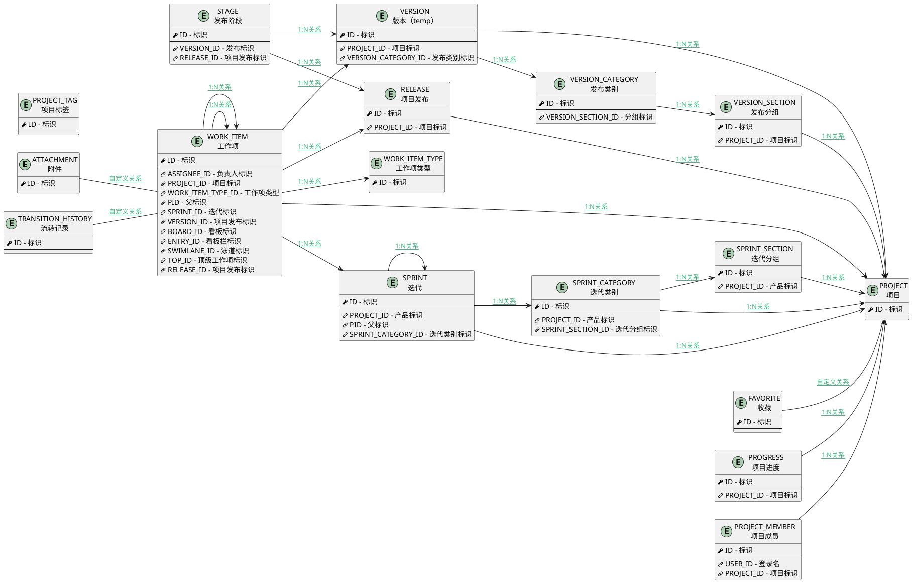

# 项目管理-scrum <!-- {docsify-ignore-all} -->

```plantuml
@startuml
<style>
root {
  HyperlinkColor #42b983
}
</style>
left to right direction

entity "ATTACHMENT\n附件" as ATTACHMENT [[$../module/Base/Attachment {附件}]] {
        <&key> ID - 标识
        --
}
entity "FAVORITE\n收藏" as FAVORITE [[$../module/Base/Favorite {收藏}]] {
        <&key> ID - 标识
        --
}
entity "PROGRESS\n项目进度" as PROGRESS [[$../module/ProjMgmt/Progress {项目进度}]] {
        <&key> ID - 标识
        --
        <&link-intact> PROJECT_ID - 项目标识
}
entity "PROJECT\n项目" as PROJECT [[$../module/ProjMgmt/Project {项目}]] {
        <&key> ID - 标识
        --
}
entity "PROJECT_MEMBER\n项目成员" as PROJECT_MEMBER [[$../module/ProjMgmt/Project_member {项目成员}]] {
        <&key> ID - 标识
        --
        <&link-intact> USER_ID - 登录名
        <&link-intact> PROJECT_ID - 项目标识
}
entity "PROJECT_TAG\n项目标签" as PROJECT_TAG [[$../module/ProjMgmt/Project_tag {项目标签}]] {
        <&key> ID - 标识
        --
}
entity "RELEASE\n项目发布" as RELEASE [[$../module/ProjMgmt/Release {项目发布}]] {
        <&key> ID - 标识
        --
        <&link-intact> PROJECT_ID - 项目标识
}
entity "SPRINT\n迭代" as SPRINT [[$../module/ProjMgmt/Sprint {迭代}]] {
        <&key> ID - 标识
        --
        <&link-intact> PROJECT_ID - 产品标识
        <&link-intact> PID - 父标识
        <&link-intact> SPRINT_CATEGORY_ID - 迭代类别标识
}
entity "SPRINT_CATEGORY\n迭代类别" as SPRINT_CATEGORY [[$../module/ProjMgmt/Sprint_category {迭代类别}]] {
        <&key> ID - 标识
        --
        <&link-intact> PROJECT_ID - 产品标识
        <&link-intact> SPRINT_SECTION_ID - 迭代分组标识
}
entity "SPRINT_SECTION\n迭代分组" as SPRINT_SECTION [[$../module/ProjMgmt/Sprint_section {迭代分组}]] {
        <&key> ID - 标识
        --
        <&link-intact> PROJECT_ID - 产品标识
}
entity "STAGE\n发布阶段" as STAGE [[$../module/ProjMgmt/Stage {发布阶段}]] {
        <&key> ID - 标识
        --
        <&link-intact> VERSION_ID - 发布标识
        <&link-intact> RELEASE_ID - 项目发布标识
}
entity "TRANSITION_HISTORY\n流转记录" as TRANSITION_HISTORY [[$../module/ProjMgmt/Transition_history {流转记录}]] {
        <&key> ID - 标识
        --
}
entity "VERSION\n版本（temp）" as VERSION [[$../module/ProjMgmt/Version {版本（temp）}]] {
        <&key> ID - 标识
        --
        <&link-intact> PROJECT_ID - 项目标识
        <&link-intact> VERSION_CATEGORY_ID - 发布类别标识
}
entity "VERSION_CATEGORY\n发布类别" as VERSION_CATEGORY [[$../module/ProjMgmt/Version_category {发布类别}]] {
        <&key> ID - 标识
        --
        <&link-intact> VERSION_SECTION_ID - 分组标识
}
entity "VERSION_SECTION\n发布分组" as VERSION_SECTION [[$../module/ProjMgmt/Version_section {发布分组}]] {
        <&key> ID - 标识
        --
        <&link-intact> PROJECT_ID - 项目标识
}
entity "WORK_ITEM\n工作项" as WORK_ITEM [[$../module/ProjMgmt/Work_item {工作项}]] {
        <&key> ID - 标识
        --
        <&link-intact> ASSIGNEE_ID - 负责人标识
        <&link-intact> PROJECT_ID - 项目标识
        <&link-intact> WORK_ITEM_TYPE_ID - 工作项类型
        <&link-intact> PID - 父标识
        <&link-intact> SPRINT_ID - 迭代标识
        <&link-intact> VERSION_ID - 项目发布标识
        <&link-intact> BOARD_ID - 看板标识
        <&link-intact> ENTRY_ID - 看板栏标识
        <&link-intact> SWIMLANE_ID - 泳道标识
        <&link-intact> TOP_ID - 顶级工作项标识
        <&link-intact> RELEASE_ID - 项目发布标识
}
entity "WORK_ITEM_TYPE\n工作项类型" as WORK_ITEM_TYPE [[$../module/ProjMgmt/Work_item_type {工作项类型}]] {
        <&key> ID - 标识
        --
}

PROGRESS--> PROJECT : [[$../der/DER1N_PROGRESS_PROJECT_PROJECT_ID{DER1N_PROGRESS_PROJECT_PROJECT_ID} 1:N关系]]
PROJECT_MEMBER--> PROJECT : [[$../der/DER1N_PROJECT_MEMBER_PROJECT_PROJECT_ID{DER1N_PROJECT_MEMBER_PROJECT_PROJECT_ID} 1:N关系]]
RELEASE--> PROJECT : [[$../der/DER1N_RELEASE_PROJECT_PROJECT_ID{DER1N_RELEASE_PROJECT_PROJECT_ID} 1:N关系]]
SPRINT_CATEGORY--> PROJECT : [[$../der/DER1N_SPRINT_CATEGORY_PROJECT_PROJECT_ID{DER1N_SPRINT_CATEGORY_PROJECT_PROJECT_ID} 1:N关系]]
SPRINT--> PROJECT : [[$../der/DER1N_SPRINT_PROJECT_PROJECT_ID{DER1N_SPRINT_PROJECT_PROJECT_ID} 1:N关系]]
SPRINT_SECTION--> PROJECT : [[$../der/DER1N_SPRINT_SECTION_PROJECT_PROJECT_ID{DER1N_SPRINT_SECTION_PROJECT_PROJECT_ID} 1:N关系]]
VERSION--> PROJECT : [[$../der/DER1N_VERSION_PROJECT_PROJECT_ID{DER1N_VERSION_PROJECT_PROJECT_ID} 1:N关系]]
VERSION_SECTION--> PROJECT : [[$../der/DER1N_VERSION_SECTION_PROJECT_PROJECT_ID{DER1N_VERSION_SECTION_PROJECT_PROJECT_ID} 1:N关系]]
WORK_ITEM--> PROJECT : [[$../der/DER1N_WORK_ITEM_PROJECT_PROJECT_ID{DER1N_WORK_ITEM_PROJECT_PROJECT_ID} 1:N关系]]
FAVORITE-- PROJECT : [[$../der/DERCCUSTOM_FAVORITE_PROJECT{DERCCUSTOM_FAVORITE_PROJECT} 自定义关系]]
STAGE--> RELEASE : [[$../der/DER1N_STAGE_RELEASE_RELEASE_ID{DER1N_STAGE_RELEASE_RELEASE_ID} 1:N关系]]
WORK_ITEM--> RELEASE : [[$../der/DER1N_WORK_ITEM_RELEASE_RELEASE_ID{DER1N_WORK_ITEM_RELEASE_RELEASE_ID} 1:N关系]]
SPRINT--> SPRINT : [[$../der/DER1N_SPRINT_SPRINT_PID{DER1N_SPRINT_SPRINT_PID} 1:N关系]]
WORK_ITEM--> SPRINT : [[$../der/DER1N_WORK_ITEM_SPRINT_SPRINT_ID{DER1N_WORK_ITEM_SPRINT_SPRINT_ID} 1:N关系]]
SPRINT--> SPRINT_CATEGORY : [[$../der/DER1N_SPRINT_SPRINT_CATEGORY_SPRINT_CATEGORY_ID{DER1N_SPRINT_SPRINT_CATEGORY_SPRINT_CATEGORY_ID} 1:N关系]]
SPRINT_CATEGORY--> SPRINT_SECTION : [[$../der/DER1N_SPRINT_CATEGORY_SPRINT_SECTION_SPRINT_SECTION_ID{DER1N_SPRINT_CATEGORY_SPRINT_SECTION_SPRINT_SECTION_ID} 1:N关系]]
STAGE--> VERSION : [[$../der/DER1N_STAGE_VERSION_VERSION_ID{DER1N_STAGE_VERSION_VERSION_ID} 1:N关系]]
WORK_ITEM--> VERSION : [[$../der/DER1N_WORK_ITEM_VERSION_VERSION_ID{DER1N_WORK_ITEM_VERSION_VERSION_ID} 1:N关系]]
VERSION--> VERSION_CATEGORY : [[$../der/DER1N_VERSION_VERSION_CATEGORY_VERSION_CATEGORY_ID{DER1N_VERSION_VERSION_CATEGORY_VERSION_CATEGORY_ID} 1:N关系]]
VERSION_CATEGORY--> VERSION_SECTION : [[$../der/DER1N_VERSION_CATEGORY_VERSION_SECTION_VERSION_SECTION_ID{DER1N_VERSION_CATEGORY_VERSION_SECTION_VERSION_SECTION_ID} 1:N关系]]
WORK_ITEM--> WORK_ITEM : [[$../der/DER1N_WORK_ITEM_WORK_ITEM_PID{DER1N_WORK_ITEM_WORK_ITEM_PID} 1:N关系]]
WORK_ITEM--> WORK_ITEM : [[$../der/DER1N_WORK_ITEM_WORK_ITEM_TOP_ID{DER1N_WORK_ITEM_WORK_ITEM_TOP_ID} 1:N关系]]
TRANSITION_HISTORY-- WORK_ITEM : [[$../der/DERCUSTOM_TRANSITION_HISTORY_WORK_ITEM{DERCUSTOM_TRANSITION_HISTORY_WORK_ITEM} 自定义关系]]
ATTACHMENT-- WORK_ITEM : [[$../der/DERCUSTOM_WORK_ITEM_ATTACHMENT{DERCUSTOM_WORK_ITEM_ATTACHMENT} 自定义关系]]
WORK_ITEM--> WORK_ITEM_TYPE : [[$../der/DER1N_WORK_ITEM_WORK_ITEM_TYPE_WORK_ITEM_TYPE_ID{DER1N_WORK_ITEM_WORK_ITEM_TYPE_WORK_ITEM_TYPE_ID} 1:N关系]]


hide methods
@enduml
```
