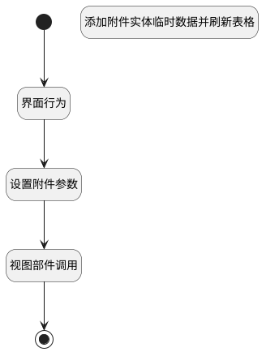

## 添加附件数据(表格) <!-- {docsify-ignore-all} -->

   

### 处理过程




### 处理步骤说明

#### 开始 :id=Begin


#### 视图部件调用 :id=VIEWCTRLINVOKE1


调用`grid(重复器表格)`的方法`addAttachMent`，参数为`attach(附件)`
#### 界面行为 :id=DEUIACTION1


调用实体 [附件(ATTACHMENT)](module/Base/Attachment.md) 界面行为 [上传附件](module/Base/Attachment#界面行为) ，行为参数为`files(上传文件)`

#### 添加附件实体临时数据并刷新表格 :id=RAWJSCODE2


<p class="panel-title"><b>执行代码</b></p>

```javascript
return (async function() { 
    // 保存数据
    await ibiz.hub.getApp(context.srfappid).deService.exec(
        'plmweb.attachment',
        'create',
        context,
        uiLogic.attach[0],
    );
    // 刷新表格
    uiLogic.grid.refresh();
    } 
)();
```

#### 结束 :id=END1


#### 设置附件参数 :id=RAWJSCODE4


<p class="panel-title"><b>执行代码</b></p>

```javascript
// 计算新建默认值
const defaultData = uiLogic.grid.calcDefaultValue({}, true);
uiLogic.attach = uiLogic.files.map(item => 
    {
        return {
            name: item.name,
            file_id: item.id,
            id: item.uuid,
            ...defaultData,
        }
    }
)
```


### 实体逻辑参数

|    中文名   |    代码名    |  数据类型      |备注 |
| --------| --------| --------  | --------   |
|上传文件|files|数据对象列表||
|当前视图对象|view|当前视图对象||
|附件|attach|数据对象列表||
|传入变量(<i class="fa fa-check"/></i>)|Default|数据对象||
|重复器表格|grid|部件对象||
