## 计算附件是否隐藏逻辑 <!-- {docsify-ignore-all} -->

   

### 处理过程

```plantuml
@startuml
hide footbox
<style>
root {
  HyperlinkColor #42b983
}
</style>

hide empty description
state "开始" as Begin <<start>> [[$./calc_attachment_hidden#begin {开始}]]
state "设置表格显示" as PREPAREJSPARAM2  [[$./calc_attachment_hidden#preparejsparam2 {设置表格显示}]]
state "获取重复器表格" as PREPAREJSPARAM1  [[$./calc_attachment_hidden#preparejsparam1 {获取重复器表格}]]
state "设置表格隐藏" as PREPAREJSPARAM3  [[$./calc_attachment_hidden#preparejsparam3 {设置表格隐藏}]]
state "结束" as END1 <<end>> [[$./calc_attachment_hidden#end1 {结束}]]


Begin --> PREPAREJSPARAM1
PREPAREJSPARAM1 --> PREPAREJSPARAM2 : [[$./calc_attachment_hidden#preparejsparam1-preparejsparam2{连接名称} 连接名称]]
PREPAREJSPARAM2 --> END1
PREPAREJSPARAM1 --> PREPAREJSPARAM3 : [[$./calc_attachment_hidden#preparejsparam1-preparejsparam3{连接名称} 连接名称]]
PREPAREJSPARAM3 --> END1


@enduml
```




### 处理步骤说明

#### 开始 :id=Begin


#### 设置表格显示 :id=PREPAREJSPARAM2


1. 将`true` 设置给  `grid(重复器表格).state.keepAlive`
2. 将`true` 设置给  `grid(重复器表格).state.visible`

#### 获取重复器表格 :id=PREPAREJSPARAM1


1. 将`form(表单).details.attachments` 设置给  `grid(重复器表格)`

#### 设置表格隐藏 :id=PREPAREJSPARAM3


1. 将`true` 设置给  `grid(重复器表格).state.keepAlive`
2. 将`false` 设置给  `grid(重复器表格).state.visible`

#### 结束 :id=END1


### 连接条件说明
#### 连接名称 :id=PREPAREJSPARAM1-PREPAREJSPARAM2

```grid(重复器表格).mdController.state.items``` ISNOTNULL
#### 连接名称 :id=PREPAREJSPARAM1-PREPAREJSPARAM3

```grid(重复器表格).mdController.state.items``` ISNULL


### 实体逻辑参数

|    中文名   |    代码名    |  数据类型      |备注 |
| --------| --------| --------  | --------   |
|表单|form|部件对象||
|传入变量(<i class="fa fa-check"/></i>)|Default|数据对象||
|重复器表格|grid|部件对象||
