## 设置默认分组 <!-- {docsify-ignore-all} -->

   

### 处理过程

```plantuml
@startuml
hide empty description
<style>
root {
  HyperlinkColor #42b983
}
</style>

hide empty description
state "开始" as Begin <<start>> [[$./set_section#begin {"开始"}]]
state "批更新子节点分组" as RAWSQLCALL1  [[$./set_section#rawsqlcall1 {"批更新子节点分组"}]]


Begin --> RAWSQLCALL1


@enduml
```




### 处理步骤说明

#### 开始 :id=Begin<sup class="footnote-symbol"> <font color=gray size=1>[开始]</font></sup>


*- N/A*
#### 批更新子节点分组 :id=RAWSQLCALL1<sup class="footnote-symbol"> <font color=gray size=1>[直接SQL调用]</font></sup>


<p class="panel-title"><b>执行sql语句</b></p>

```sql
update category set section_id=? where INSTR(categories,?)>0
```

<p class="panel-title"><b>执行sql参数</b></p>

1. `Default(传入变量).SECTION_ID(分组标识)`
2. `Default(传入变量).ID(标识)`


### 实体逻辑参数

|    中文名   |    代码名    |  数据类型    |  实体   |备注 |
| --------| --------| -------- | -------- | --------   |
|传入变量(<i class="fa fa-check"/></i>)|Default|数据对象|[类别(CATEGORY)](module/Base/Category.md)||
