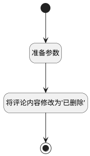

## 删除评论 <!-- {docsify-ignore-all} -->

   

### 处理过程

### 处理步骤说明

#### 开始 :id=Begin [开始]

*- N/A*
#### 准备参数 :id=PREPAREPARAM1 [准备参数]

1. 将`
<del>该评论已删除</del>
` 设置给  `Default(传入变量).CONTENT(内容)`

#### 将评论内容修改为"已删除" :id=DEACTION1 [实体行为]

调用实体 [评论(COMMENT)](module/Base/Comment.md) 行为 [Update](module/Base/Comment#行为) ，行为参数为`Default(传入变量)`

将执行结果返回给参数`Default(传入变量)`

#### 结束 :id=END1 [结束]

*- N/A*

### 实体逻辑参数

|    中文名   |    代码名    |  数据类型    |  实体   |备注 |
| --------| --------| -------- | -------- | --------   |
|传入变量(<i class="fa fa-check"/></i>)|Default|数据对象|[评论(COMMENT)](module/Base/Comment.md)||
