## 删除（表单中） <!-- {docsify-ignore-all} -->

   

### 处理过程

```plantuml
@startuml
hide footbox
<style>
root {
  HyperlinkColor #42b983
}
</style>

hide empty description
state "开始" as Begin <<start>> [[$./del#begin {开始}]]
state "视图部件调用" as VIEWCTRLINVOKE1  [[$./del#viewctrlinvoke1 {视图部件调用}]]
state "注入脚本代码" as RAWJSCODE2  [[$./del#rawjscode2 {注入脚本代码}]]
state "准备参数" as PREPAREJSPARAM1  [[$./del#preparejsparam1 {准备参数}]]
state "注入脚本代码" as RAWJSCODE3  [[$./del#rawjscode3 {注入脚本代码}]]


Begin --> PREPAREJSPARAM1
PREPAREJSPARAM1 --> RAWJSCODE2
RAWJSCODE2 --> VIEWCTRLINVOKE1
VIEWCTRLINVOKE1 --> RAWJSCODE3


@enduml
```




### 处理步骤说明

#### 开始 :id=Begin


#### 视图部件调用 :id=VIEWCTRLINVOKE1


调用`form(主表单对象)`的方法`save`，参数为`files(上传文件)`
#### 注入脚本代码 :id=RAWJSCODE2


<p class="panel-title"><b>执行代码</b></p>

```javascript
ibiz.hub.getApp(context.srfappid).deService.exec(
    'plmweb.deliverable',
    'remove',
    context,
    uiLogic.default,
);


```

#### 准备参数 :id=PREPAREJSPARAM1


1. 将`Default(传入变量).id` 设置给  `context(上下文).deliverable`
2. 将`view(当前视图对象).parentView.layoutPanel.panelItems.form.control` 设置给  `form(主表单对象)`

#### 注入脚本代码 :id=RAWJSCODE3


<p class="panel-title"><b>执行代码</b></p>

```javascript
if(uiLogic.view.layoutPanel.panelItems.total.data.total == 0){
    view.layoutPanel.panelItems.grid.state.visible = false;
}
```


### 实体逻辑参数

|    中文名   |    代码名    |  数据类型      |备注 |
| --------| --------| --------  | --------   |
|上传文件|files|数据对象列表||
|上下文|context|导航视图参数绑定参数||
|主表单对象|form|部件对象||
|当前视图对象|view|当前视图对象||
|传入变量(<i class="fa fa-check"/></i>)|Default|数据对象||
