## 动态数据看板名称(DYNADASHBOARDNAME) <!-- {docsify-ignore-all} -->

   

### 默认规则 :id=Default

```plantuml
@startuml
hide empty description
<style>
root {
  HyperlinkColor #42b983
}
</style>

state "start" as start  <<start>>
state "end" as end <<end>>
state "默认字符串长度" as 5b4a82eedd37cc370f2b08d8bfec7187 [[$./DynaDashboardName#a5b4a82eedd37cc370f2b08d8bfec7187 {"默认字符串长度"}]]


start --> 5b4a82eedd37cc370f2b08d8bfec7187 
5b4a82eedd37cc370f2b08d8bfec7187 --> end 


@enduml
```

#### 条件说明

##### 默认字符串长度 :id=a5b4a82eedd37cc370f2b08d8bfec7187

*关键条件*

`DYNADASHBOARDNAME(动态数据看板名称)` 属性长度在区间 `(0 , 200]` 内

> [!ATTENTION|label:规则信息|icon:fa fa-warning]
> 内容长度必须小于等于[200]

