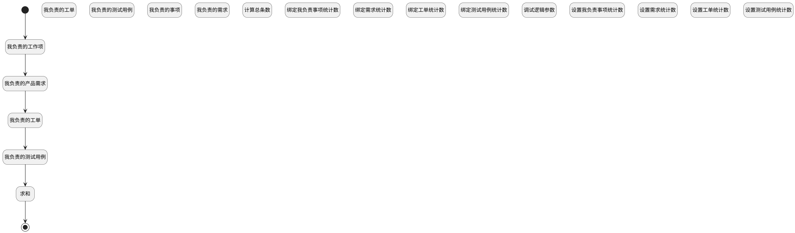

## 我负责的事项 <!-- {docsify-ignore-all} -->

   

### 处理过程




### 处理步骤说明

#### 开始 :id=Begin<sup class="footnote-symbol"> <font color=gray size=1>[开始]</font></sup>


*- N/A*
#### 结束 :id=END1<sup class="footnote-symbol"> <font color=gray size=1>[结束]</font></sup>


返回 `Default(传入变量)`

#### 我负责的工作项 :id=RAWSQLCALL1<sup class="footnote-symbol"> <font color=gray size=1>[直接SQL调用]</font></sup>


<p class="panel-title"><b>执行sql语句</b></p>

```sql
SELECT count(t.id) as my_charge_work_item FROM work_item t where t.IS_DELETED = 0 AND t.IS_ARCHIVED = 0 AND t.ASSIGNEE_ID = ?
```

<p class="panel-title"><b>执行sql参数</b></p>

1. `用户全局对象.srfpersonid`

重置参数`Default(传入变量)`，并将执行sql结果赋值给参数`Default(传入变量)`

#### 我负责的产品需求 :id=RAWSQLCALL2<sup class="footnote-symbol"> <font color=gray size=1>[直接SQL调用]</font></sup>


<p class="panel-title"><b>执行sql语句</b></p>

```sql
-- 我负责的产品需求
SELECT count(t.id) as my_charge_idea FROM idea t where t.IS_DELETED = 0 AND t.IS_ARCHIVED = 0 AND t.ASSIGNEE_ID = ?
```

<p class="panel-title"><b>执行sql参数</b></p>

1. `用户全局对象.srfpersonid`

重置参数`Default(传入变量)`，并将执行sql结果赋值给参数`Default(传入变量)`

#### 我负责的工单 :id=RAWSQLCALL3<sup class="footnote-symbol"> <font color=gray size=1>[直接SQL调用]</font></sup>


<p class="panel-title"><b>执行sql语句</b></p>

```sql
-- 我负责的工单
SELECT count(t.id) as my_charge_ticket FROM ticket t where t.IS_DELETED = 0 AND t.IS_ARCHIVED = 0 AND t.ASSIGNEE_ID = ?
```

<p class="panel-title"><b>执行sql参数</b></p>

1. `用户全局对象.srfpersonid`

重置参数`Default(传入变量)`，并将执行sql结果赋值给参数`Default(传入变量)`

#### 我负责的测试用例 :id=RAWSQLCALL4<sup class="footnote-symbol"> <font color=gray size=1>[直接SQL调用]</font></sup>


<p class="panel-title"><b>执行sql语句</b></p>

```sql
-- 我负责的测试用例
SELECT count(t.id) as my_charge_test_case FROM test_case t where t.IS_DELETED = 0 AND t.IS_ARCHIVED = 0 AND t.MAINTENANCE_ID = ?
```

<p class="panel-title"><b>执行sql参数</b></p>

1. `用户全局对象.srfpersonid`

重置参数`Default(传入变量)`，并将执行sql结果赋值给参数`Default(传入变量)`

#### 求和 :id=RAWSQLCALL5<sup class="footnote-symbol"> <font color=gray size=1>[直接SQL调用]</font></sup>


<p class="panel-title"><b>执行sql语句</b></p>

```sql
SELECT (
    (SELECT count(id) FROM work_item WHERE IS_DELETED = 0 AND IS_ARCHIVED = 0 AND ASSIGNEE_ID = ?) +
    (SELECT count(id) FROM idea WHERE IS_DELETED = 0 AND IS_ARCHIVED = 0 AND ASSIGNEE_ID = ?) +
    (SELECT count(id) FROM ticket WHERE IS_DELETED = 0 AND IS_ARCHIVED = 0 AND ASSIGNEE_ID = ?) +
    (SELECT count(id) FROM test_case WHERE IS_DELETED = 0 AND IS_ARCHIVED = 0 AND MAINTENANCE_ID = ?)
) AS my_charge_total
```

<p class="panel-title"><b>执行sql参数</b></p>

1. `用户全局对象.srfpersonid`
2. `用户全局对象.srfpersonid`
3. `用户全局对象.srfpersonid`
4. `用户全局对象.srfpersonid`

重置参数`Default(传入变量)`，并将执行sql结果赋值给参数`Default(传入变量)`

#### 我负责的工单 :id=DEDATASET3<sup class="footnote-symbol"> <font color=gray size=1>[实体数据集]</font></sup>


调用实体 [工单(TICKET)](module/ProdMgmt/Ticket.md) 数据集合 [我负责的工单(my_assignee_count)](module/ProdMgmt/Ticket#数据集合) ，查询参数为`filter`

将执行结果返回给参数`my_assignee(我负责的事项)`

#### 我负责的测试用例 :id=DEDATASET4<sup class="footnote-symbol"> <font color=gray size=1>[实体数据集]</font></sup>


调用实体 [用例(TEST_CASE)](module/TestMgmt/Test_case.md) 数据集合 [我负责的用例(my_assignee_count_test_case)](module/TestMgmt/Test_case#数据集合) ，查询参数为`filter`

将执行结果返回给参数`my_assignee(我负责的事项)`

#### 我负责的事项 :id=DEDATASET1<sup class="footnote-symbol"> <font color=gray size=1>[实体数据集]</font></sup>


调用实体 [工作项(WORK_ITEM)](module/ProjMgmt/Work_item.md) 数据集合 [我负责的（统计）(my_assignee_count)](module/ProjMgmt/Work_item#数据集合) ，查询参数为`filter`

将执行结果返回给参数`my_assignee(我负责的事项)`

#### 我负责的需求 :id=DEDATASET2<sup class="footnote-symbol"> <font color=gray size=1>[实体数据集]</font></sup>


调用实体 [需求(IDEA)](module/ProdMgmt/Idea.md) 数据集合 [我负责的需求(my_assignee_count)](module/ProdMgmt/Idea#数据集合) ，查询参数为`filter`

将执行结果返回给参数`my_assignee(我负责的事项)`

#### 计算总条数 :id=RAWSFCODE1<sup class="footnote-symbol"> <font color=gray size=1>[直接后台代码]</font></sup>


<p class="panel-title"><b>执行代码[JavaScript]</b></p>

```groovy
var Default = logic.getParam("Default");
//从Default中取出来工作项、需求、工单、用例的计数值
var work_item = Default.get("my_charge_work_item");
var idea = Default.get("my_charge_idea");
var ticket = Default.get("my_charge_ticket");
var test_case = Default.get("my_charge_test_case");
// 计算总和
var total = work_item + idea + ticket + test_case;

// 将总和保存回Default对象
Default.set("my_charge_total", total);

```

#### 绑定我负责事项统计数 :id=BINDPARAM1<sup class="footnote-symbol"> <font color=gray size=1>[绑定参数]</font></sup>


绑定参数`my_assignee(我负责的事项)` 到 `temp_obj`
#### 绑定需求统计数 :id=BINDPARAM2<sup class="footnote-symbol"> <font color=gray size=1>[绑定参数]</font></sup>


绑定参数`my_assignee(我负责的事项)` 到 `temp_obj`
#### 绑定工单统计数 :id=BINDPARAM3<sup class="footnote-symbol"> <font color=gray size=1>[绑定参数]</font></sup>


绑定参数`my_assignee(我负责的事项)` 到 `temp_obj`
#### 绑定测试用例统计数 :id=BINDPARAM4<sup class="footnote-symbol"> <font color=gray size=1>[绑定参数]</font></sup>


绑定参数`my_assignee(我负责的事项)` 到 `temp_obj`
#### 调试逻辑参数 :id=DEBUGPARAM1<sup class="footnote-symbol"> <font color=gray size=1>[调试逻辑参数]</font></sup>


> [!NOTE|label:调试信息|icon:fa fa-bug]
> 调试输出参数`Default(传入变量)`的详细信息


#### 设置我负责事项统计数 :id=PREPAREPARAM1<sup class="footnote-symbol"> <font color=gray size=1>[准备参数]</font></sup>


1. 将`temp_obj.count_work_item` 设置给  `Default(传入变量).my_charge_work_item`

#### 设置需求统计数 :id=PREPAREPARAM2<sup class="footnote-symbol"> <font color=gray size=1>[准备参数]</font></sup>


1. 将`temp_obj.count_idea` 设置给  `Default(传入变量).my_charge_idea`

#### 设置工单统计数 :id=PREPAREPARAM3<sup class="footnote-symbol"> <font color=gray size=1>[准备参数]</font></sup>


1. 将`temp_obj.count_ticket` 设置给  `Default(传入变量).my_charge_ticket`

#### 设置测试用例统计数 :id=PREPAREPARAM4<sup class="footnote-symbol"> <font color=gray size=1>[准备参数]</font></sup>


1. 将`temp_obj.count_test_case` 设置给  `Default(传入变量).my_charge_test_case`


### 实体逻辑参数

|    中文名   |    代码名    |  数据类型    |  实体   |备注 |
| --------| --------| -------- | -------- | --------   |
|传入变量(<i class="fa fa-check"/></i>)|Default|数据对象|[最近访问(RECENT)](module/Base/Recent.md)||
|filter|filter|过滤器|||
|我负责的事项|my_assignee|分页查询|||
|temp_obj|temp_obj|数据对象|||
