## 添加项目 <!-- {docsify-ignore-all} -->

   

### 处理过程

```plantuml
@startuml
hide empty description
<style>
root {
  HyperlinkColor #42b983
}
</style>

hide empty description
state "开始" as Begin <<start>> [[$./add_project#begin {"开始"}]]
state "准备参数" as PREPAREPARAM2  [[$./add_project#prepareparam2 {"准备参数"}]]
state "循环子调用" as LOOPSUBCALL1  [[$./add_project#loopsubcall1 {"循环子调用"}]] #green {
state "重置参数" as RESETPARAM1  [[$./add_project#resetparam1 {"重置参数"}]]
state "准备参数" as PREPAREPARAM1  [[$./add_project#prepareparam1 {"准备参数"}]]
state "实体行为" as DEACTION1  [[$./add_project#deaction1 {"实体行为"}]]
}


Begin --> PREPAREPARAM2
PREPAREPARAM2 --> LOOPSUBCALL1
LOOPSUBCALL1 --> RESETPARAM1
RESETPARAM1 --> PREPAREPARAM1
PREPAREPARAM1 --> DEACTION1


@enduml
```




### 处理步骤说明

#### 开始 :id=Begin<sup class="footnote-symbol"> <font color=gray size=1>[开始]</font></sup>


*- N/A*
#### 准备参数 :id=PREPAREPARAM2<sup class="footnote-symbol"> <font color=gray size=1>[准备参数]</font></sup>


1. 将`Default(传入变量).srfactionparam` 绑定给  `srfactionparam(所选项目列表)`

#### 循环子调用 :id=LOOPSUBCALL1<sup class="footnote-symbol"> <font color=gray size=1>[循环子调用]</font></sup>


循环参数`srfactionparam(所选项目列表)`，子循环参数使用`for_temp_obj(循环临时变量)`
#### 重置参数 :id=RESETPARAM1<sup class="footnote-symbol"> <font color=gray size=1>[重置参数]</font></sup>


重置参数```create_obj(工作对象)```
#### 准备参数 :id=PREPAREPARAM1<sup class="footnote-symbol"> <font color=gray size=1>[准备参数]</font></sup>


1. 将`for_temp_obj(循环临时变量).ID(标识)` 设置给  `create_obj(工作对象).PRINCIPAL_ID(关联主体标识)`
2. 将`Default(传入变量).portfolio_id(文件夹标识)` 设置给  `create_obj(工作对象).PORTFOLIO_ID(文件夹标识)`
3. 将`project` 设置给  `create_obj(工作对象).PRINCIPAL_TYPE(关联主体类型)`
4. 将`for_temp_obj(循环临时变量).NAME(项目名称)` 设置给  `create_obj(工作对象).NAME(名称)`

#### 实体行为 :id=DEACTION1<sup class="footnote-symbol"> <font color=gray size=1>[实体行为]</font></sup>


调用实体 [工作(WORK)](module/Base/Work.md) 行为 [Save](module/Base/Work#行为) ，行为参数为`create_obj(工作对象)`


### 实体逻辑参数

|    中文名   |    代码名    |  数据类型    |  实体   |备注 |
| --------| --------| -------- | -------- | --------   |
|传入变量(<i class="fa fa-check"/></i>)|Default|数据对象|[工作(WORK)](module/Base/Work.md)||
|工作对象|create_obj|数据对象|[工作(WORK)](module/Base/Work.md)||
|循环临时变量|for_temp_obj|数据对象|[项目(PROJECT)](module/ProjMgmt/Project.md)||
|所选项目列表|srfactionparam|数据对象列表|[项目(PROJECT)](module/ProjMgmt/Project.md)||
