## 工作时长表单项更新 <!-- {docsify-ignore-all} -->

   

### 处理过程

```plantuml
@startuml
hide empty description
<style>
root {
  HyperlinkColor #42b983
}
</style>

hide empty description
state "开始" as Begin <<start>> [[$./duration_updateform#begin {"开始"}]]
state "计算剩余工时和工时进度" as RAWSFCODE1  [[$./duration_updateform#rawsfcode1 {"计算剩余工时和工时进度"}]]
state "结束" as END1 <<end>> [[$./duration_updateform#end1 {"结束"}]]


Begin --> RAWSFCODE1
RAWSFCODE1 --> END1


@enduml
```




### 处理步骤说明

#### 开始 :id=Begin<sup class="footnote-symbol"> <font color=gray size=1>[开始]</font></sup>


*- N/A*
#### 计算剩余工时和工时进度 :id=RAWSFCODE1<sup class="footnote-symbol"> <font color=gray size=1>[直接后台代码]</font></sup>


<p class="panel-title"><b>执行代码[JavaScript]</b></p>

```groovy
var defaultObj = logic.getParam("default");
var actual_workload = defaultObj.get("actual_workload") == null ? 0 : defaultObj.get("actual_workload");
var estimated_workload = defaultObj.get("estimated_workload") == null ? 0 : defaultObj.get("estimated_workload");
var duration = defaultObj.get("duration");
var remaining_workload = estimated_workload - actual_workload - duration;
remaining_workload = remaining_workload < 0 ? 0 : remaining_workload;
defaultObj.set("remaining_workload", remaining_workload.toFixed(1));

if((Number(actual_workload) + Number(remaining_workload) + duration) > 0 && (Number(actual_workload) + duration > 0)){
    var workload_schedule = ((Number(actual_workload) + Number(duration)) / (Number(actual_workload) + duration + Number(remaining_workload))) * 100;
    defaultObj.set("workload_schedule", workload_schedule);
    if(workload_schedule > 100){
        defaultObj.set("workload_schedule", 100);
    }
}
```

#### 结束 :id=END1<sup class="footnote-symbol"> <font color=gray size=1>[结束]</font></sup>


返回 `Default(传入变量)`


### 实体逻辑参数

|    中文名   |    代码名    |  数据类型    |  实体   |备注 |
| --------| --------| -------- | -------- | --------   |
|传入变量(<i class="fa fa-check"/></i>)|Default|数据对象|[工时(WORKLOAD)](module/Base/Workload.md)||
