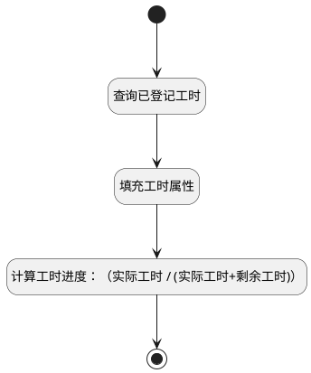

## 获取草稿（工作项） <!-- {docsify-ignore-all} -->

   

### 处理过程




### 处理步骤说明

#### 开始 :id=Begin<sup class="footnote-symbol"> <font color=gray size=1>[开始]</font></sup>


*- N/A*
#### 查询已登记工时 :id=RAWSQLCALL1<sup class="footnote-symbol"> <font color=gray size=1>[直接SQL调用]</font></sup>


<p class="panel-title"><b>执行sql语句</b></p>

```sql
select t1.ESTIMATED_WORKLOAD, t1.REMAINING_WORKLOAD, sum(t2.DURATION) as `ACTUAL_WORKLOAD`
from work_item t1 left join workload t2 on t1.ID = t2.PRINCIPAL_ID
where t1.ID = ?
```

<p class="panel-title"><b>执行sql参数</b></p>

1. `Default(传入变量).PRINCIPAL_ID(工时主体标识)`

重置参数`temp_obj(临时对象)`，并将执行sql结果赋值给参数`temp_obj(临时对象)`

#### 填充工时属性 :id=PREPAREPARAM1<sup class="footnote-symbol"> <font color=gray size=1>[准备参数]</font></sup>


1. 将`temp_obj(临时对象).ACTUAL_WORKLOAD(实际工时)` 设置给  `Default(传入变量).actual_workload`
2. 将`temp_obj(临时对象).REMAINING_WORKLOAD(剩余工时)` 设置给  `Default(传入变量).remaining_workload`
3. 将`temp_obj(临时对象).ESTIMATED_WORKLOAD(预估工时)` 设置给  `Default(传入变量).estimated_workload`

#### 计算工时进度：（实际工时 / (实际工时+剩余工时)） :id=RAWSFCODE1<sup class="footnote-symbol"> <font color=gray size=1>[直接后台代码]</font></sup>


<p class="panel-title"><b>执行代码[JavaScript]</b></p>

```groovy
var defaultObj = logic.getParam("default");
var actual_workload = defaultObj.get("actual_workload") == null ? 0 : defaultObj.get("actual_workload");
var remaining_workload = defaultObj.get("remaining_workload") == null ? 0 : defaultObj.get("remaining_workload");
if((actual_workload + remaining_workload) > 0 && actual_workload > 0){
    var workload_schedule = (actual_workload / (actual_workload + remaining_workload)) * 100;
    defaultObj.set("workload_schedule", workload_schedule.toFixed(1));
    if(workload_schedule > 100){
        defaultObj.set("workload_schedule", 100);
    }
}
if(defaultObj.get("actual_workload") != null){
    defaultObj.set("actual_workload", Number(actual_workload).toFixed(1));
}
```

#### 结束 :id=END1<sup class="footnote-symbol"> <font color=gray size=1>[结束]</font></sup>


返回 `Default(传入变量)`


### 实体逻辑参数

|    中文名   |    代码名    |  数据类型    |  实体   |备注 |
| --------| --------| -------- | -------- | --------   |
|传入变量(<i class="fa fa-check"/></i>)|Default|数据对象|[工时(WORKLOAD)](module/Base/Workload.md)||
|临时对象|temp_obj|数据对象|[工作项(WORK_ITEM)](module/ProjMgmt/Work_item.md)||
