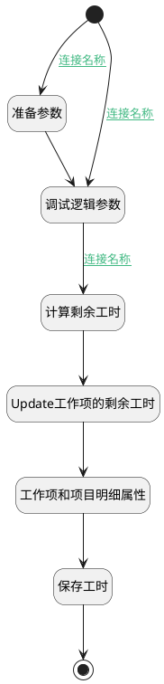

## 保存工时并更新工作项剩余工时 <!-- {docsify-ignore-all} -->

   

### 处理过程

### 处理步骤说明

#### 开始 :id=Begin [开始]

*- N/A*
#### 准备参数 :id=PREPAREPARAM2 [准备参数]

1. 将`空值（NULL）` 设置给  `Default(传入变量).ID(标识)`

#### 调试逻辑参数 :id=DEBUGPARAM1 [调试逻辑参数]

> [!NOTE|label:调试信息|icon:fa fa-bug]
> 调试输出参数`Default(传入变量)`的详细信息

#### 计算剩余工时 :id=PREPAREPARAM1 [准备参数]

1. 将`Default(传入变量).PRINCIPAL_ID(工时主体标识)` 设置给  `work_item(工作项).ID(标识)`
2. 将`Default(传入变量).remaining_workload` 设置给  `work_item(工作项).REMAINING_WORKLOAD(剩余工时)`

#### Update工作项的剩余工时 :id=DEACTION1 [实体行为]

调用实体 [工作项(WORK_ITEM)](module/ProjMgmt/Work_item.md) 行为 [Update](module/ProjMgmt/Work_item#行为) ，行为参数为`work_item(工作项)`

将执行结果返回给参数`work_item(工作项)`

#### 工作项和项目明细属性 :id=PREPAREPARAM3 [准备参数]

1. 将`work_item(工作项).IDENTIFIER(编号)` 设置给  `Default(传入变量).IDENTIFIER(编号)`
2. 将`work_item(工作项).PROJECT_ID(项目标识)` 设置给  `Default(传入变量).RECENT_PARENT(访问父类)`
3. 将`work_item(工作项).PROJECT_IDENTIFIER(项目标识)` 设置给  `Default(传入变量).RECENT_PARENT_IDENTIFIER(访问父类编号)`
4. 将`work_item(工作项).PROJECT_NAME(所属项目)` 设置给  `Default(传入变量).RECENT_PARENT_NAME(访问父类名称)`
5. 将`work_item(工作项).TITLE(标题)` 设置给  `Default(传入变量).NAME(名称)`

#### 保存工时 :id=DEACTION2 [实体行为]

调用实体 [工时(WORKLOAD)](module/Base/Workload.md) 行为 [Save](module/Base/Workload#行为) ，行为参数为`Default(传入变量)`

将执行结果返回给参数`Default(传入变量)`

#### 结束 :id=END1 [结束]

*- N/A*

### 连接条件说明
#### 连接名称 :id=Begin-PREPAREPARAM2

`Default(传入变量).ID(标识)` EQ `undefined`
#### 连接名称 :id=DEBUGPARAM1-PREPAREPARAM1

`Default(传入变量).PRINCIPAL_TYPE(工时主体类型)` EQ `WORK_ITEM`
#### 连接名称 :id=Begin-DEBUGPARAM1

`Default(传入变量).ID(标识)` NOTEQ `undefined`

### 实体逻辑参数

|    中文名   |    代码名    |  数据类型    |  实体   |备注 |
| --------| --------| -------- | -------- | --------   |
|传入变量(<i class="fa fa-check"/></i>)|Default|数据对象|[工时(WORKLOAD)](module/Base/Workload.md)||
|工作项|work_item|数据对象|[工作项(WORK_ITEM)](module/ProjMgmt/Work_item.md)||
