## 产品客户关联分页计数器 <!-- {docsify-ignore-all} -->

   

### 处理过程

```plantuml
@startuml
hide empty description
<style>
root {
  HyperlinkColor #42b983
}
</style>

hide empty description
state "开始" as Begin <<start>> [[$./product_customer_re_counters#begin {"开始"}]]
state "结束" as END1 <<end>> [[$./product_customer_re_counters#end1 {"结束"}]]
state "客户关联工单" as RAWSQLCALL1  [[$./product_customer_re_counters#rawsqlcall1 {"客户关联工单"}]]


Begin --> RAWSQLCALL1
RAWSQLCALL1 --> END1


@enduml
```




### 处理步骤说明

#### 开始 :id=Begin<sup class="footnote-symbol"> <font color=gray size=1>[开始]</font></sup>


*- N/A*
#### 结束 :id=END1<sup class="footnote-symbol"> <font color=gray size=1>[结束]</font></sup>


返回 `Default(传入变量)`

#### 客户关联工单 :id=RAWSQLCALL1<sup class="footnote-symbol"> <font color=gray size=1>[直接SQL调用]</font></sup>


<p class="panel-title"><b>执行sql语句</b></p>

```sql
SELECT
	COUNT( t2.id ) as customer_re_ticket
FROM
	customer t,
	ticket t2 
WHERE
	t.id = ? 
	AND t.id = t2.CUSTOMER_ID 
	AND t2.IS_DELETED = 0 
	AND t2.IS_ARCHIVED = 0
```

<p class="panel-title"><b>执行sql参数</b></p>

1. `Default(传入变量).ID(标识)`

重置参数`Default(传入变量)`，并将执行sql结果赋值给参数`Default(传入变量)`


### 实体逻辑参数

|    中文名   |    代码名    |  数据类型    |  实体   |备注 |
| --------| --------| -------- | -------- | --------   |
|传入变量(<i class="fa fa-check"/></i>)|Default|数据对象|[客户(CUSTOMER)](module/ProdMgmt/Customer.md)||
