## 产品需求关联分页计数器 <!-- {docsify-ignore-all} -->

   计算分页下关联事项的条数

### 处理过程

```plantuml
@startuml
hide empty description
<style>
root {
  HyperlinkColor #42b983
}
</style>

hide empty description
state "开始" as Begin <<start>> [[$./product_idea_re_counters#begin {"开始"}]]
state "结束" as END1 <<end>> [[$./product_idea_re_counters#end1 {"结束"}]]
state "需求关联客户" as RAWSQLCALL1  [[$./product_idea_re_counters#rawsqlcall1 {"需求关联客户"}]]
state "需求关联需求" as RAWSQLCALL2  [[$./product_idea_re_counters#rawsqlcall2 {"需求关联需求"}]]
state "需求关联工单" as RAWSQLCALL3  [[$./product_idea_re_counters#rawsqlcall3 {"需求关联工单"}]]
state "需求关联工作项" as RAWSQLCALL4  [[$./product_idea_re_counters#rawsqlcall4 {"需求关联工作项"}]]
state "需求关联测试用例" as RAWSQLCALL5  [[$./product_idea_re_counters#rawsqlcall5 {"需求关联测试用例"}]]


Begin --> RAWSQLCALL1
RAWSQLCALL1 --> RAWSQLCALL2
RAWSQLCALL2 --> RAWSQLCALL3
RAWSQLCALL3 --> RAWSQLCALL4
RAWSQLCALL4 --> RAWSQLCALL5
RAWSQLCALL5 --> END1


@enduml
```




### 处理步骤说明

#### 开始 :id=Begin<sup class="footnote-symbol"> <font color=gray size=1>[开始]</font></sup>


*- N/A*
#### 结束 :id=END1<sup class="footnote-symbol"> <font color=gray size=1>[结束]</font></sup>


返回 `Default(传入变量)`

#### 需求关联客户 :id=RAWSQLCALL1<sup class="footnote-symbol"> <font color=gray size=1>[直接SQL调用]</font></sup>


<p class="panel-title"><b>执行sql语句</b></p>

```sql
-- 需求关联客户
SELECT
	count( t.id ) AS idea_re_customer 
FROM
	customer t 
WHERE
	EXISTS (
	SELECT
		* 
	FROM
		`RELATION` t11 
	WHERE
		t.`ID` = t11.`TARGET_ID` 
		AND (
			t11.`TARGET_TYPE` = 'customer' 
			AND t11.`PRINCIPAL_TYPE` = 'idea' 
			AND t11.`PRINCIPAL_ID` = ? ) )
			AND (
				t.`IS_DELETED` = 0 AND t.`is_archived` = 0
			)
```

<p class="panel-title"><b>执行sql参数</b></p>

1. `Default(传入变量).ID(标识)`

重置参数`Default(传入变量)`，并将执行sql结果赋值给参数`Default(传入变量)`

#### 需求关联需求 :id=RAWSQLCALL2<sup class="footnote-symbol"> <font color=gray size=1>[直接SQL调用]</font></sup>


<p class="panel-title"><b>执行sql语句</b></p>

```sql
-- 需求
SELECT
	count( t.id ) AS idea_re_idea 
FROM
	idea t 
WHERE
	EXISTS (
	SELECT
		* 
	FROM
		`RELATION` t11 
	WHERE
		t.`ID` = t11.`TARGET_ID` 
		AND ( t11.`PRINCIPAL_ID` = ? AND t11.`TARGET_TYPE` = 'idea' AND t11.`PRINCIPAL_TYPE` = 'idea' ) 
	) 
	AND ( t.`IS_ARCHIVED` = 0 AND t.`IS_DELETED` = 0 )
```

<p class="panel-title"><b>执行sql参数</b></p>

1. `Default(传入变量).ID(标识)`

重置参数`Default(传入变量)`，并将执行sql结果赋值给参数`Default(传入变量)`

#### 需求关联工单 :id=RAWSQLCALL3<sup class="footnote-symbol"> <font color=gray size=1>[直接SQL调用]</font></sup>


<p class="panel-title"><b>执行sql语句</b></p>

```sql
-- 工单
SELECT
	count( t.id ) AS idea_re_ticket 
FROM
	ticket t 
WHERE
	EXISTS (
	SELECT
		* 
	FROM
		`RELATION` t11 
	WHERE
		t.`ID` = t11.`TARGET_ID` 
		AND ( t11.`PRINCIPAL_ID` = ? AND t11.`TARGET_TYPE` = 'ticket' AND t11.`PRINCIPAL_TYPE` = 'idea' ) 
	) 
	AND ( t.`IS_ARCHIVED` = 0 AND t.`IS_DELETED` = 0 )
```

<p class="panel-title"><b>执行sql参数</b></p>

1. `Default(传入变量).ID(标识)`

重置参数`Default(传入变量)`，并将执行sql结果赋值给参数`Default(传入变量)`

#### 需求关联工作项 :id=RAWSQLCALL4<sup class="footnote-symbol"> <font color=gray size=1>[直接SQL调用]</font></sup>


<p class="panel-title"><b>执行sql语句</b></p>

```sql
-- 工作项
SELECT
	count( t.id ) AS idea_re_work_item 
FROM
	work_item t 
WHERE
	EXISTS (
	SELECT
		* 
	FROM
		`RELATION` t11 
	WHERE
		t.`ID` = t11.`TARGET_ID` 
		AND ( t11.`PRINCIPAL_ID` = ? AND t11.`TARGET_TYPE` = 'work_item' AND t11.`PRINCIPAL_TYPE` = 'idea' ) 
	) 
	AND ( t.`IS_ARCHIVED` = 0 AND t.`IS_DELETED` = 0 )
```

<p class="panel-title"><b>执行sql参数</b></p>

1. `Default(传入变量).ID(标识)`

重置参数`Default(传入变量)`，并将执行sql结果赋值给参数`Default(传入变量)`

#### 需求关联测试用例 :id=RAWSQLCALL5<sup class="footnote-symbol"> <font color=gray size=1>[直接SQL调用]</font></sup>


<p class="panel-title"><b>执行sql语句</b></p>

```sql
-- 测试用例
SELECT
	count( t.id ) AS idea_re_test_case
FROM
	test_case t 
WHERE
	EXISTS (
	SELECT
		* 
	FROM
		`RELATION` t11 
	WHERE
		t.`ID` = t11.`TARGET_ID` 
		AND ( t11.`PRINCIPAL_ID` = ? AND t11.`TARGET_TYPE` = 'test_case' AND t11.`PRINCIPAL_TYPE` = 'idea' ) 
	) 
	AND ( t.`IS_ARCHIVED` = 0 AND t.`IS_DELETED` = 0 )
```

<p class="panel-title"><b>执行sql参数</b></p>

1. `Default(传入变量).ID(标识)`

重置参数`Default(传入变量)`，并将执行sql结果赋值给参数`Default(传入变量)`


### 实体逻辑参数

|    中文名   |    代码名    |  数据类型    |  实体   |备注 |
| --------| --------| -------- | -------- | --------   |
|传入变量(<i class="fa fa-check"/></i>)|Default|数据对象|[需求(IDEA)](module/ProdMgmt/Idea.md)||
