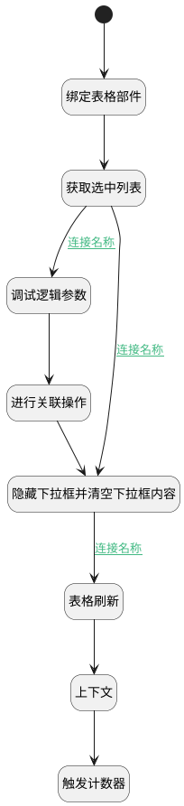

## 关联需求值变更 <!-- {docsify-ignore-all} -->

   关联操作时触发，内部调用关联逻辑进行关联操作

### 处理过程




### 处理步骤说明

#### 开始 :id=Begin


#### 调试逻辑参数 :id=DEBUGPARAM1


> [!NOTE|label:调试信息|icon:fa fa-bug]
> 调试输出参数`传入后台对象`的详细信息

#### 隐藏下拉框并清空下拉框内容 :id=RAWJSCODE1


<p class="panel-title"><b>执行代码</b></p>

```javascript
const panel = view.layoutPanel.panelItems.choose_data;
if (panel) {
    panel.state.visible = false;
}
uiLogic.default.choose_data = null;

```

#### 触发计数器 :id=RAWJSCODE6


<p class="panel-title"><b>执行代码</b></p>

```javascript

ibiz.mc.command.update.send({ srfdecodename: context.principal_type})
```

#### 表格刷新 :id=VIEWCTRLINVOKE1


调用`grid(表格对象)`的方法`refresh`，参数为`Default(传入变量)`
#### 进行关联操作 :id=DEACTION1


调用实体 [需求(IDEA)](module/ProdMgmt/Idea.md) 行为 [其他实体关联需求(others_relation_idea)](module/ProdMgmt/Idea#行为) ，行为参数为`dto(传入后台对象)`

#### 获取选中列表 :id=RAWJSCODE2


<p class="panel-title"><b>执行代码</b></p>

```javascript
let choose = uiLogic.default.choose_data;
if(choose != null && choose != ''){
    uiLogic.dto.srfactionparam = JSON.parse(choose);
    uiLogic.dto.principal_id = view.context.principal_id;
    uiLogic.dto.principal_type = view.context.principal_type;
    uiLogic.dto.target_type = view.context.target_type;
}
```

#### 绑定表格部件 :id=PREPAREJSPARAM1


1. 将`view(视图对象).layoutPanel.panelItems.grid.control` 设置给  `grid(表格对象)`

#### 上下文 :id=DEBUGPARAM2


> [!NOTE|label:调试信息|icon:fa fa-bug]
> 调试输出参数`上下文`的详细信息

### 连接条件说明
#### 连接名称 :id=RAWJSCODE2-DEBUGPARAM1

```dto(传入后台对象).srfactionparam``` ISNOTNULL
#### 连接名称 :id=RAWJSCODE1-VIEWCTRLINVOKE1

```dto(传入后台对象).srfactionparam``` ISNOTNULL
#### 连接名称 :id=RAWJSCODE2-RAWJSCODE1

```dto(传入后台对象).srfactionparam``` ISNULL


### 实体逻辑参数

|    中文名   |    代码名    |  数据类型      |备注 |
| --------| --------| --------  | --------   |
|表格对象|grid|部件对象||
|传入后台对象|dto|数据对象||
|传入变量(<i class="fa fa-check"/></i>)|Default|数据对象||
|上下文|ctx|导航视图参数绑定参数||
|视图对象|view|当前视图对象||
